# feat: Render test-author prose as markdown HTML, not plain text

## Summary

Test-author prose surfaced in `cts-test-selector`'s
`.oidf-test-selector__row-summary` (raw `plan.summary`) and
`cts-log-detail-header`'s `.ctsHeroBody` rendered as flat/literal text. Per the
maintainer's direction, this prose **is markdown** — it carries paragraphs,
bullet lists, inline `` `code` ``, and bare `https://` URLs — and is now
rendered markdown→HTML with a fast client-side library.

**Approach (per Kaelig, 2026-05-27):** use [`marked`](https://github.com/markedjs/marked)
to parse markdown and [DOMPurify](https://github.com/cure53/DOMPurify) to
sanitize the result before Lit's `unsafeHTML`. This reverses an earlier
research-driven instinct to hand-roll a formatter. The one hard technical
constraint that shaped the library choice: the prose is dense with snake_case
identifiers (`access_token`, `claims_supported`), and naive 1-KB parsers
(snarkdown/nano-markdown) mangle these into emphasis (`access<em>token</em>` —
verified empirically). `marked` follows CommonMark's intraword-underscore rule
and leaves them intact, renders the loose `* item` lists these summaries use,
and (with GFM) autolinks the ~27 bare URLs — at ~13 KB gzip, one self-contained
ESM file. markdown-it is correct too but ~3× larger; the tiny parsers are
disqualified by the snake_case test.

---

## Problem Frame

`formatDescription` (`src/main/resources/static/components/format-description.js`)
was introduced for MR-1998 item C2 with a deliberately narrow scope (`\n\n` → `
`,
`` `code` `` → `<code>`, "Intentionally NOT a Markdown subset"). That scope left
gaps against the real content and user expectation:

1. **Bare URLs rendered as unclickable text** at every site using the helper
   (`ctsHeroBody`, `.summaryBody`). ~27 summaries embed RFC/spec/Bitbucket URLs.
2. **Bullet lists rendered as literal `* ` text** — some descriptions (e.g. CIBA
   binding-message tests) use loose `\n\n * item` lists.
3. **`cts-test-selector` row-summary applied no formatting at all** — raw
   `${plan.summary}`, surfacing literal markdown noise in the plan-list teaser.

A third block site renders the same `plan.summary` field raw and is a natural
parity target: `.planSummary` in `cts-plan-header`.

**Critical structural constraint:** the row-summary span is nested **inside the
plan-row `<button>`** (`cts-test-selector.js:487`). Autolinked `<a>` (interactive
content nested in a button = invalid HTML + ambiguous keyboard activation) and
block `
`/`<ul>` (break the one-line teaser) are disallowed there. The teaser
needs **inline-only** rendering: inline `<code>`/`<em>`/`<strong>` (valid phrasing
content inside a button) with anchors stripped.

---

## Requirements

| ID | Requirement |
|----|-------------|
| R1 | Test-author prose renders as markdown HTML at every block site (`ctsHeroBody`, `.summaryBody`, `.planSummary`): paragraphs, bullet lists, inline code, and autolinked bare `http`/`https` URLs. |
| R2 | Markdown output is sanitized by DOMPurify before `unsafeHTML`. Dangerous markup (`<script>`, `onerror`, etc.) never reaches the DOM, and a DOMPurify hook forces every surviving link to `target="_blank" rel="noopener noreferrer"`. |
| R3 | snake_case identifiers (`access_token`, `claims_supported`) render verbatim — never mangled into emphasis. |
| R4 | `cts-test-selector` row-summary renders inline markdown (`<code>`/`<em>`/`<strong>`) with whitespace collapsed to one line, emitting **no** `<a>` or block `
`/`<ul>` (button-safe). |
| R5 | `cts-plan-header` `.planSummary` renders the same block markdown as `ctsHeroBody`. |
| R6 | Every changed component carries Storybook play-function coverage (autolink, snake_case safety, XSS stripping, inline-no-anchor); the helper's render paths are browser-tested via those stories. |
| R7 | marked + DOMPurify are vendored with no build step, pinned to exact versions, and the existing static pages keep rendering (importmap drift avoided). |

---

## Key Technical Decisions

**KTD-1 — Use `marked` for parsing (reverses the earlier "no library"
instinct).** The content is markdown and the maintainer directed a fast
client-side library. Empirically, `marked` (GFM defaults) preserves snake_case,
renders the loose `* item` lists, and autolinks bare URLs; snarkdown corrupts
all three (`id<em>token</em>`, and even mangles URLs). markdown-it is correct but
~44 KB vs marked's ~13 KB gzip. No mature Lit-native markdown element exists;
`zero-md` bundles marked+highlight.js+KaTeX+Mermaid behind a shadow root that
wouldn't inherit `oidf-tokens.css`. So: `marked`, one self-contained ESM file.

**KTD-2 — Sanitize with DOMPurify; `unsafeHTML` is the deviation, sanitization is
the contract.** `marked` does not sanitize, so its output always passes through
DOMPurify before `unsafeHTML`. This introduces the codebase's first `unsafeHTML`
use (house style is escape-by-default), paired with the OWASP-recommended
sanitizer so the deviation is the *standard* safe-markdown pattern, not a
footgun. A DOMPurify `afterSanitizeAttributes` hook enforces safe link rels. The
test prose is build-time Java constants (low runtime-XSS exposure), but
sanitization is non-negotiable once `unsafeHTML` is in play. **Flag for
maintainer review** (almgren/thomasdarimont) — see Risks.

**KTD-3 — Two render modes from the same helper.** `formatDescription(text)`
returns `unsafeHTML(DOMPurify.sanitize(marked.parse(text)))` (block: paragraphs,
lists, code, links). `formatSummaryPreview(text)` returns
`unsafeHTML(DOMPurify.sanitize(marked.parseInline(collapsed), { FORBID_TAGS: ["a"] }))`
(inline-only, anchors stripped) for the button teaser. `marked.parseInline`
emits no block wrappers; `FORBID_TAGS: ["a"]` removes interactive nesting.

**KTD-4 — Vendor with the lit pattern (importmap + node_modules), not relative
imports.** marked/DOMPurify are vendored as single ESM files under `vendor/` and
resolved via each page's importmap in the browser; for tests/type-check they
resolve from `frontend/node_modules` (pinned exact devDeps) through a
`.storybook/main.js` Vite alias and `tsconfig.json` `paths` entry — mirroring how
`lit` is handled. A relative `../vendor/...` import was rejected because tsc
follows it and floods the un-minified bundle with type errors. The vendored copy
and the devDependency must stay the same version (documented in each vendor
README).

---

## High-Level Technical Design

Per-site treatment matrix:

| Render site | File | Context | Mode | Lists/Paragraphs | Inline `<code>` | Autolinked `<a>` |
|-------------|------|---------|------|:---:|:---:|:---:|
| `ctsHeroBody` | `cts-log-detail-header.js` | block `
` | block | ✅ | ✅ | ✅ |
| `.summaryBody` | `cts-test-summary.js` | block `
` | block | ✅ | ✅ | ✅ |
| `.planSummary` | `cts-plan-header.js` | block `
` | block | ✅ | ✅ | ✅ |
| `.oidf-test-selector__row-summary` | `cts-test-selector.js` | **inside `<button>`** | inline | ❌ (collapsed) | ✅ | ❌ (text only) |

Render pipeline:

```mermaid
flowchart TD
  A[plan.summary / description] --> B{render mode}
  B -->|block| C["marked.parse &#40;GFM&#41;"]
  B -->|inline / button| D["marked.parseInline &#40;whitespace collapsed&#41;"]
  C --> E[DOMPurify.sanitize]
  D --> F["DOMPurify.sanitize &#123;FORBID_TAGS: ['a']&#125;"]
  E --> G[afterSanitizeAttributes hook:<br/>a → target=_blank rel=noopener noreferrer]
  F --> H[unsafeHTML → Lit child binding]
  G --> H
```

Resolution: browser → importmap (`/vendor/marked`, `/vendor/dompurify`);
tests/tsc → `frontend/node_modules` via Vite alias + tsconfig `paths`.

---

## Implementation Units

### U1. Markdown rendering helper (marked + DOMPurify) + vendoring + wiring

**Goal:** Replace the bespoke formatter with marked+DOMPurify; block sites
(`ctsHeroBody`, `.summaryBody`) render full markdown including autolinked URLs.

**Requirements:** R1, R2, R3, R6, R7.

**Files:**
- `src/main/resources/static/components/format-description.js` — `formatDescription` (block) + `formatSummaryPreview` (inline) over marked+DOMPurify; `afterSanitizeAttributes` link hook.
- `src/main/resources/static/vendor/marked/{marked.esm.js,README.md}`, `src/main/resources/static/vendor/dompurify/{purify.es.mjs,README.md}` — vendored, version-pinned.
- `frontend/package.json` — exact devDeps `marked@18.0.4`, `dompurify@3.4.7`.
- `frontend/.storybook/main.js` — Vite aliases; `frontend/tsconfig.json` — `paths` entries.
- All 10 static HTML pages — `marked`/`dompurify` importmap entries (uniform with the lit importmap).
- `cts-test-summary.stories.js`, `cts-log-detail-header.stories.js` — autolink + snake_case + XSS-sanitization play tests.

**Test scenarios** (Storybook, browser DOM):
- Covers R1. A hero/summary with a bare URL renders `<a href=… target=_blank rel="noopener noreferrer">`.
- Covers R3. snake_case prose (`access_token`) renders verbatim — 0 `<em>`.
- Covers R2. A summary containing `<script>`/`` renders neither — no script element, no `onerror` attribute, and the payload never executes.
- Regression: `\n\n` → 2 `
`; inline backticks → `<code>`; lone backtick renders literally (0 `<code>`).

**Verification:** cts-test-summary + cts-log-detail-header stories pass; type-check clean; bare URLs are clickable new-tab links in the hero.

---

### U2. Button-safe inline summary for `cts-test-selector` row-summary

**Goal:** The plan-list teaser renders inline markdown without elements invalid
inside a `<button>`.

**Requirements:** R4, R6.

**Dependencies:** U1 (`formatSummaryPreview`).

**Files:**
- `cts-test-selector.js` — import + use `formatSummaryPreview(plan.summary)` at the row-summary span.
- `cts-test-selector.stories.js` — play test asserting inline `<code>` and zero `<a>`/`
`.

**Test scenarios:**
- Covers R4. A summary with `` `purpose` `` and a URL renders `<code>purpose</code>`, **0** `<a>`, **0** `
`; snake_case preserved; no literal backtick leaks.
- Empty/null summary → no summary span (unchanged).
- e2e baselines (`schedule-test-baselines.spec.js`) unchanged — plain-text fixtures render identically (verified; marker normalization absorbs the `unsafeHTML` difference).

**Verification:** cts-test-selector stories pass; baseline e2e passes without regeneration.

---

### U3. Block-render parity for `cts-plan-header` `.planSummary`

**Goal:** The plan-detail summary callout matches the block hero treatment.

**Requirements:** R5, R6.

**Dependencies:** U1 (`formatDescription`).

**Files:**
- `cts-plan-header.js` — import + use `formatDescription(plan.summary)` at `.planSummary`.
- `cts-plan-header.stories.js` — play test for paragraphs + autolinked URL + inline code.

**Test scenarios:**
- Covers R5. A `plan.summary` with two paragraphs + a bare URL + inline code renders 2 `
`, one safe `<a>`, one `<code>`.
- `.planLede` (`plan.description`, a user-typed label) left as plain text — out of scope.

**Verification:** cts-plan-header stories pass.

---

## Scope Boundaries

**In scope:** marked+DOMPurify rendering helper; the four render sites; vendoring
+ wiring; Storybook coverage.

### Deferred to Follow-Up Work
- Truncation / "show more" for long teasers.
- `spec_links` curated chip integration (MR-1998 D2) — separate, backend-coupled.
- `.planLede` formatting (user-typed label, different content class).

### Outside this change
- Backend `/api/info` changes — all formatting stays frontend-side at render time
  (per `docs/plans/2026-04-25-008-feat-r24-test-description-vs-instructions-plan.md`).

---

## Risks & Dependencies

- **Maintainer-boundary + `unsafeHTML` deviation (P1).** This introduces the
  codebase's first `unsafeHTML` use and two vendored runtime deps, expanding the
  MR-1998 C2 two-transform scope to full markdown. **Mitigation:** DOMPurify
  sanitization (OWASP standard) + link-rel hook + XSS story; flag explicitly in
  the PR for almgren/thomasdarimont review. Reversible (helper-local + vendor dir).
- **Vendored-vs-devDep version drift.** Browser loads `/vendor/*`; tests/tsc load
  `node_modules`. **Mitigation:** exact pins + README bump procedure noting both
  must move together.
- **Pre-existing baselines.** `feat/redesign` carries known e2e + Storybook flakes
  (user-memory `feedback_e2e_pre_existing_failures_2026_05_20`,
  `feedback_storybook_pre_existing_flakes`) and a pre-existing cts-toast.js
  type-check baseline (`feedback_cts_toast_typecheck_pre_existing`). Stash-baseline
  before attributing a failure to this change.

---

## Sources & Research
- Origin: `docs/plans/2026-05-22-001-mr1998-maintainer-feedback-brief.md` (C2).
- Helper history: `docs/plans/2026-04-25-008-feat-r24-test-description-vs-instructions-plan.md`.
- Vendoring constraint: `docs/solutions/best-practices/lit-directives-via-importmap-vendored-bundle-2026-04-18.md`.
- CommonMark intraword underscore (snake_case protection): https://spec.commonmark.org/0.31.2/#emphasis-and-strong-emphasis
- marked removed built-in sanitize in v8: https://marked.js.org/using_advanced
- OWASP — DOMPurify + http/https href allowlist: https://cheatsheetseries.owasp.org/cheatsheets/Cross_Site_Scripting_Prevention_Cheat_Sheet.html
- Empirical (this session): marked preserves `access_token`/`claims_supported` and the loose `* item` list and autolinks bare URLs; snarkdown mangles all three.
