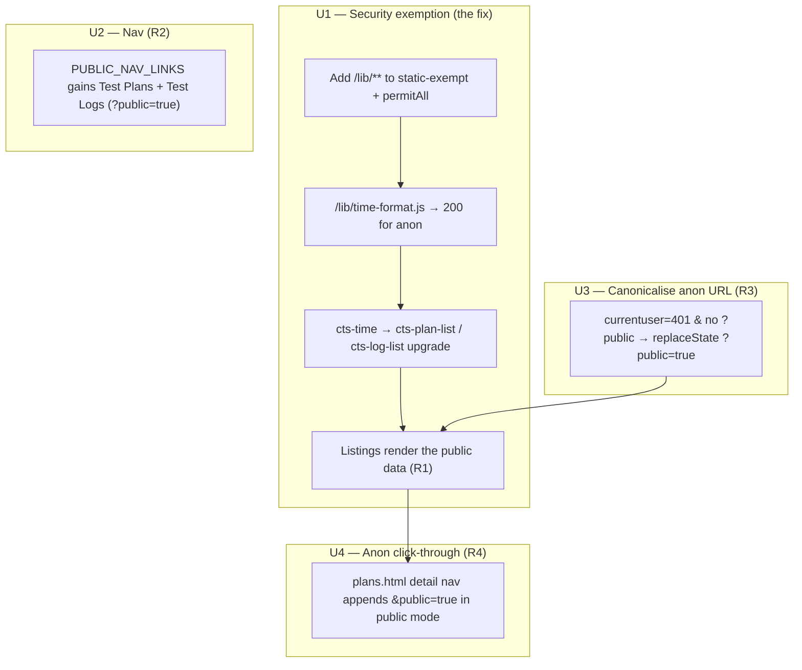

# fix: Restore logged-out public plans/logs browsing on feat/redesign

## Summary

On `feat/redesign`, logged-out visitors see **empty** Test Plans and Test Logs
listings even though the data exists and is publicly served. Production/staging
(old frontend, same backend) renders these correctly at `?public=true`.

The root cause is a **Spring Security static-asset exemption gap**: the `/lib/`
directory was never added to the exempt list, so for anonymous users
`/lib/time-format.js` 302-redirects to `login.html`. The browser rejects that
HTML as an ES module, the import failure cascades up `cts-time.js` →
`cts-plan-list.js` / `cts-log-list.js`, and those list components never finish
defining as custom elements. The `/api/plan?public=true` /
`/api/log?public=true` fetches succeed (11 records each on the review app), but
there is no upgraded component left to render them.

This plan fixes the regression at its root (one security-config exemption) and
completes the logged-out browse experience the user asked for: nav links always
present, anonymous pages canonicalised to `?public=true`, and anonymous
click-through to plan detail.

---

## Problem Frame

**Reported by the user**, reproduced against `https://review-app-dev-branch-22.certification.openid.net`:

1. All published plans and logs should be viewable by logged-out users — as
   production does at `staging.certification.openid.net/plans.html?public=true`
   and `.../logs.html?public=true`.
2. On the review app (feat/redesign), `plans.html?public=true` and
   `logs.html?public=true` show **nothing** for logged-out users.
3. Logged-out visits to these pages should **automatically land in
   `?public=true`** mode.

**Constraint surfaced by the user:** the local dev app cannot reproduce the
logged-out experience, because the `dev` Spring profile activates
`DummyUserFilter` (`fintechlabs.devmode=true`), which injects a synthetic
admin user on every request (see `CLAUDE.md` → "Never set
`SPRING_PROFILES_ACTIVE=dev`…"). You are never anonymous under the dev profile.
This shapes the verification strategy (see below): the regression itself is only
exercisable via a security-layer test or a non-dev/deployed environment, while
the frontend behaviours are exercisable via E2E specs that mock
`/api/currentuser` → 401.

---

## Root Cause Analysis

This section is load-bearing — the fix only makes sense against the evidence.

### Evidence (collected during planning, against the review app)

- **Backend serves the data.** Anonymous `curl` of the review app:
  - `GET /api/plan?public=true` → `{"recordsTotal":11, …, "data":[…]}` (11 plans)
  - `GET /api/log?public=true` → `{"recordsTotal":11, …, "data":[…]}` (11 logs)
- **The security config is already correct for the data endpoints.**
  `getPublicMatcher()` in
  `src/main/java/net/openid/conformance/security/WebSecurityResourceServerConfig.java`
  permits `GET /api/plan` and `GET /api/log` when the `?public` param is present
  (`PublicRequestMatcher` → `Boolean.parseBoolean(request.getParameter("public"))`).
  The HTML pages `/plans.html` and `/logs.html` are permitted unconditionally in
  `WebSecurityOidcLoginConfig`.
- **The component never upgrades.** In the loaded page (logged out,
  `plans.html?public=true`), `document.querySelector('cts-plan-list')` exists but
  has **no `shadowRoot`** and **no `_plans`** — i.e. `customElements.define()`
  never ran for it.
- **The failing network request.** The only failing module load is
  `GET /lib/time-format.js → 302` → `login.html (200, text/html)`, producing the
  console error: *"Failed to load module script: Expected a JavaScript-or-Wasm
  module script but the server responded with a MIME type of text/html."*

### The cascade

```
Spring Security static-exempt list (WebSecurityConfig.staticResourcesIgnoreCustomizer)
  exempts: /css /js /vendor /components /images /fonts /templates /favicon.ico
  MISSING: /lib                         ◄── the gap
        │
        ▼ (anonymous request)
GET /lib/time-format.js  ──302──▶  /login.html  (text/html)
        │
        ▼ (ES module MIME rejection)
cts-time.js  (import { … } from "../lib/time-format.js")  ── fails to evaluate
        │
        ▼ (static import dependency)
cts-plan-list.js  (import "./cts-time.js")  ── fails to evaluate
cts-log-list.js   (import "./cts-time.js")  ── fails to evaluate
        │
        ▼
<cts-plan-list> / <cts-log-list> never customElements.define()
        │
        ▼
Listings render nothing for anonymous users — despite the data fetch succeeding
```

### Why it only affects logged-out users

For authenticated users, `/lib/time-format.js` resolves (200) because the request
carries a session and passes `anyRequest().authenticated()`. Only the anonymous
path 302-redirects, so the cascade is invisible to logged-in users and to the
local dev profile (which is always "logged in" as the dummy admin).

### Why production works

Production runs the **old frontend**, which did not import `/lib/time-format.js`
via the `cts-time` → `cts-plan-list`/`cts-log-list` chain. The `/lib/` directory
and these Lit components are redesign-era additions, so the exemption gap is a
redesign-only regression.

---

## Requirements

| ID | Requirement | Source |
|----|-------------|--------|
| R1 | Logged-out users see published plans at `plans.html?public=true` and published logs at `logs.html?public=true` (the listings render the data the API already returns). | User report (2) |
| R2 | "Test Plans" and "Test Logs" appear in the navbar at all times, for logged-in and logged-out users. | User report (nav) |
| R3 | Logged-out visits to `plans.html` / `logs.html` automatically resolve to `?public=true` mode (URL reflects public mode; downstream links carry it). | User report (3) |
| R4 | A logged-out user can click a published plan in the listing and reach `plan-detail.html` without hitting a login redirect. | Implied by R1 (browse must be navigable); regression found during planning |
| R5 | The fix must not weaken authentication for any non-static path, and must not change the authenticated user's default views (bare `plans.html`/`logs.html` stay "My"). | Security invariant |

---

## Key Technical Decisions

**KTD1 — Fix the root cause in the security exemption list, not by patching each component.**
Add `/lib/**` to `WebSecurityConfig.staticResourcesIgnoreCustomizer()` (the
`web.ignoring()` list). `web.ignoring()` removes the path from the filter chain
entirely *before* any chain runs, so it fixes both the OIDC-login chain and the
resource-server chain in one place, and — per the existing comment in that file —
restores correct browser caching headers for these JS assets (matching `/js`,
`/components`, `/vendor`). This is the minimal, correct fix and mirrors exactly
how the redesign's other component assets are already exempted.

**KTD2 — Mirror the entry in the OIDC permit list for defence-in-depth.**
`/components/**` is currently listed in *both* `WebSecurityConfig` (ignoring) and
`WebSecurityOidcLoginConfig`'s `permitAll()` block — the latter as a documented
"defence-in-depth fallback". Add `/lib/**` to that `permitAll()` list too so the
two configs stay consistent and a future refactor that drops the `ignoring()`
entry does not silently re-break anonymous loads.

**KTD3 — Exempt the whole `/lib/**` directory, not just `time-format.js`.**
`/lib/` also contains `spec-links.js` and `config-field-types.js`, which are
imported by other components that may appear on public pages. Exempting the
directory (consistent with `/js/**`, `/components/**`) prevents the same class of
regression from recurring with a different `/lib/` file. The directory contains
only non-sensitive static JS — no data, no secrets — so directory-level
exemption carries no security cost.

**KTD4 — Canonicalise the anonymous URL to `?public=true` client-side, not via a server 302.**
A server-side redirect of bare `plans.html` → `plans.html?public=true` is wrong:
bare `plans.html` is the **authenticated** user's "My" view, and the server
cannot distinguish "anon wants public" from "authed wants My" for an HTML shell
that is intentionally public to both. Therefore the canonicalisation must be
client-side, gated on the existing `/api/currentuser` auth probe resolving to
anonymous (401). Use `history.replaceState` (no reload, preserves the page's
single-fetch no-flash contract — KTD3 of the existing plans-home design) rather
than a `location` redirect.

**KTD5 — Public nav links point at `?public=true`; authenticated links stay bare.**
Keep the two-list structure in `cts-navbar.js`. `PUBLIC_NAV_LINKS` (shown to
anonymous visitors) uses `plans.html?public=true` / `logs.html?public=true` so
anonymous nav clicks land directly in public mode; `NAV_LINKS` (authenticated)
keeps bare hrefs so logged-in users get their "My" views. This also satisfies the
pre-existing (currently failing) assertion in `frontend/e2e/login.spec.js` that
expects `plans.html?public=true` / `logs.html?public=true` in the anonymous
navbar.

---

## High-Level Technical Design

The four units map onto the cascade and the browse flow:



U1 is the regression fix and the only one that must be verified at the
security/HTTP layer. U2–U4 are frontend-only and verifiable via E2E with a mocked
401.

---

## Implementation Units

### U1. Add `/lib/**` to the Spring Security static-asset exemption

**Goal:** Anonymous requests for `/lib/*.js` return the file (200), so the
`cts-time` → `cts-plan-list`/`cts-log-list` module chain evaluates and the public
listings render. This is the root-cause fix for R1.

**Requirements:** R1, R5.

**Dependencies:** none (do this first — it unblocks observable verification of all others).

**Files:**
- `src/main/java/net/openid/conformance/security/WebSecurityConfig.java` — add `"/lib/**"` to the `web.ignoring().requestMatchers(...)` list (KTD1, KTD3). Update the surrounding Javadoc list of exempt paths to include `/lib/*`.
- `src/main/java/net/openid/conformance/security/WebSecurityOidcLoginConfig.java` — add `"/lib/**"` to the `permitAll()` `requestMatchers(...)` block (KTD2), with a brief comment matching the `/components/**` rationale ("Lit component support modules loaded by public pages").
- `src/test/java/net/openid/conformance/security/StaticAssetExemptionTest.java` *(new)* — test file (see Test scenarios).

**Approach:** Single-token additions to two allow-lists. No logic changes.
Confirm the patterns are `/lib/**` (Ant-style) to match the directory and all
nested files. Do **not** touch `/api/**` rules — the data endpoints are already
correct.

**Patterns to follow:** The existing `/components/**` entries in both files are
the exact template — `/lib/**` should sit alongside them with parallel comments.
`src/test/java/net/openid/conformance/security/PathMatchingTest.java` is the
pattern for an `AntPathMatcher`-based, no-Spring-context unit test.

**Test scenarios:**
- **Exemption matches `/lib` assets.** Using `AntPathMatcher` against the exempt
  pattern(s), assert `/lib/time-format.js`, `/lib/spec-links.js`, and
  `/lib/config-field-types.js` all match `/lib/**`. (This may require exposing the
  pattern list as a package-visible constant in `WebSecurityConfig` so the test
  can read it rather than hard-coding the string; prefer extracting the constant
  so the test pins the *actual* configured list, not a copy.)
- **Exemption does not over-match.** Assert `/api/plan` and `/api/log` do **not**
  match `/lib/**` (guards R5 — the fix must not accidentally exempt API paths).
- **Higher-fidelity alternative (include if a MockMvc/`@SpringBootTest` security
  harness is reasonably available):** an integration test asserting anonymous
  `GET /lib/time-format.js` returns 200 (not 302 to `/login.html`) and a
  `Content-Type` of `text/javascript`/`application/javascript`. If no such
  harness exists in the repo, do **not** scaffold one for this fix; the
  `AntPathMatcher` unit test plus the E2E coverage in U2–U4 is sufficient.

**Verification:** `mvn test -Dtest=StaticAssetExemptionTest` passes. On a
non-dev/deployed build, anonymous `plans.html?public=true` and
`logs.html?public=true` render the published listings (the originating symptom is
gone).

---

### U2. Always show "Test Plans" and "Test Logs" in the navbar

**Goal:** R2 — the two primary navigation links are present for anonymous and
authenticated users alike.

**Requirements:** R2.

**Dependencies:** none (independent of U1, but only *visibly* correct once U1
lets the destination pages render).

**Files:**
- `src/main/resources/static/components/cts-navbar.js` — add Test Plans and Test Logs to `PUBLIC_NAV_LINKS` with `?public=true` hrefs (KTD5); update the U9 design comment (lines ~7–12) to reflect that the public listing links are intentionally present again. Keep `tokens` authenticated-only and keep `NAV_LINKS` (authed) hrefs bare.
- `frontend/e2e/login.spec.js` — the existing test `cts-navbar renders in unauthenticated state` (currently failing, pre-existing) already asserts `a[href="logs.html?public=true"]` and `a[href="plans.html?public=true"]`; it should now pass. Adjust only if the chosen hrefs differ.
- `src/main/resources/static/components/cts-navbar.stories.js` *(if present and it has a logged-out/public story with assertions)* — update story assertions to expect the two links in the anonymous state.

**Approach:** Data-only change to the `PUBLIC_NAV_LINKS` array plus comment
update. The existing `_renderNavLinks()` logic already renders whatever list is
selected; no template change needed. Verify `current-page` highlighting still
keys off `page: "plans"` / `page: "logs"`.

**Patterns to follow:** The existing `NAV_LINKS` / `PUBLIC_NAV_LINKS` shape and
the `_renderNavLinks()` selection logic in `cts-navbar.js`.

**Test scenarios:**
- **Anonymous navbar shows public links.** With `/api/currentuser` mocked → 401,
  assert the navbar contains visible `a[href="plans.html?public=true"]` and
  `a[href="logs.html?public=true"]`, and does **not** contain "Logged in as"
  (revives the pre-existing `login.spec.js` assertion).
- **Anonymous navbar hides authenticated-only links.** Assert the `Tokens` link
  is absent for the anonymous user.
- **Authenticated navbar uses bare hrefs.** With a mocked user, assert
  `a[href="plans.html"]` and `a[href="logs.html"]` (My views) are present — the
  authenticated link shape is unchanged.

---

### U3. Canonicalise logged-out `plans.html` / `logs.html` to `?public=true`

**Goal:** R3 — when a logged-out user lands on a bare listing URL, the page
resolves to public mode and the URL reflects it.

**Requirements:** R3.

**Dependencies:** U1 (so the canonicalised page actually renders content).

**Files:**
- `src/main/resources/static/plans.html` — in the existing `/api/currentuser`
  resolver (the `.then((user) => …)` block, ~lines 110–131), when
  `authenticated === false` **and** the URL has no `public=true`, call
  `history.replaceState` to add `public=true` to the URL before/at the point the
  deferred fetch is resolved to the public dataset.
- `src/main/resources/static/logs.html` — apply the equivalent in its
  `getUserInfo()`-based auth resolver (~lines 102–159), reusing the existing
  `explicitPublic` / `isPublic` computation.

**Approach:** Reuse the auth probe that both pages already run; do **not** add a
second probe or a server round-trip (KTD4). Use `history.replaceState`
(no reload). Keep the change inside the existing anonymous branch so the
authenticated "My" default at the bare URL is untouched (R5). Ensure the
canonicalisation cooperates with `cts-view-tabs` (which treats `?public=true` as
the canonical Published signal and manages the param via `pushState`/`popstate`)
— replaceState here only *adds* the param for anon at first paint; tab
interactions continue to own subsequent param changes.

**Patterns to follow:** The existing inline first-paint gating script in
`plans.html` (the `is-public` / `defer-initial-fetch` logic) and `logs.html`'s
`explicitPublic` computation; `cts-view-tabs.js`'s documented "`?public=true` is
the canonical Published signal" contract.

**Test scenarios:**
- **Anon bare URL canonicalises.** Mock `/api/currentuser` → 401, load
  `plans.html` (no param); after the probe resolves, assert `location.search`
  contains `public=true` and the public listing is rendered. Repeat for
  `logs.html`.
- **Anon explicit URL is left alone.** Load `plans.html?public=true`; assert no
  duplicate param and the public listing renders. Repeat for `logs.html`.
- **Authenticated bare URL is NOT canonicalised (R5).** Mock a logged-in user,
  load bare `plans.html`; assert the URL stays bare and the "My" view loads (no
  `public=true` added). Repeat for `logs.html`.
- **No full navigation / reload.** Assert the canonicalisation uses
  `replaceState` (URL changes without a navigation) — e.g. the page does not
  re-request the document.

---

### U4. Thread `public=true` into anonymous plan-detail click-through

**Goal:** R4 — a logged-out user clicking a published plan reaches
`plan-detail.html` in public mode instead of a login redirect.

**Requirements:** R4.

**Dependencies:** U1 (listing must render to be clickable).

**Files:**
- `src/main/resources/static/plans.html` — in the `cts-plan-navigate` handler
  (~line 146, `window.location.href = 'plan-detail.html?plan=' + …`), append
  `&public=true` when the listing is in public mode (`planList.hasAttribute('is-public')`).

**Approach:** Mirror the pattern `cts-log-list.js` already uses (lines
~1220–1228) where log/plan detail hrefs append `&public=true` in public mode.
`plan-detail.html` already reads `?public=true` and handles the anonymous path
(it appends `public=true` to its own API calls and uses `getUserInfo`), so no
detail-page change is needed once the link carries the param. Logs already thread
the param via `cts-log-list`, so **no logs-side change is required** — verify
this during implementation rather than duplicating it.

**Patterns to follow:** `cts-log-list.js` detail-href construction (the
`publicSuffix` pattern); `plan-detail.html`'s existing `isPublic` handling.

**Test scenarios:**
- **Anon click-through carries the param.** With a mocked public listing and 401
  auth, simulate clicking a plan card; assert the resulting navigation target is
  `plan-detail.html?plan=<id>&public=true`.
- **Authenticated click-through stays private.** With a mocked user on the "My"
  view (no `is-public`), assert the target is `plan-detail.html?plan=<id>` (no
  `public=true`).
- **Regression guard for logs (verification, not new code):** confirm the
  existing `cts-log-list` log/plan detail links already include `&public=true` in
  public mode (assert in an existing or new `logs.spec.js` case) so logs
  click-through is covered.

---

## Scope Boundaries

**In scope:** the four units above — the `/lib/**` security exemption, the
always-on nav links, the anonymous URL canonicalisation, and the anonymous
plan-detail click-through.

**Out of scope (not regressions, not requested):**
- Changing what "published" means or how implementers publish plans/logs
  (`publish: summary|everything`) — the backend and data model are correct.
- Exposing the *catalog of available test definitions* (schedule-test.html) to
  anonymous users — the user clarified the ask is published plan/log **instances**,
  which already exist and are served.
- The `Boolean(urlParams.get('public'))` truthiness quirk in `plan-detail.html`
  (line ~731) — pre-existing, treats `?public=false` as truthy. Harmless for this
  flow (we only ever pass `public=true`). Left untouched.

### Deferred to Follow-Up Work
- Consider relocating `/lib/*.js` under `/js/` (or another already-exempt prefix)
  so the "new top-level static dir not in the exempt list" failure mode cannot
  recur. This is a structural cleanup, not needed to fix the reported bug, and
  would touch every importer (`../lib/...` → `../js/...`). File separately if
  desired.
- A lint/ArchUnit guard asserting every top-level dir under
  `src/main/resources/static/` referenced by a public-page module import is
  covered by the security exempt list — would prevent the entire class of
  regression. Out of scope here.

---

## Risks & Dependencies

| Risk | Likelihood | Impact | Mitigation |
|------|-----------|--------|------------|
| `/lib/**` pattern accidentally over-matches an API or sensitive path | Low | High (auth bypass) | U1 test asserts `/api/plan` / `/api/log` do **not** match `/lib/**`; `/lib/` contains only non-sensitive static JS; pattern is directory-scoped. |
| Client-side canonicalisation (U3) fights `cts-view-tabs` param ownership and causes a param flip-flop | Low | Medium | Apply `replaceState` once, in the anon branch of the existing auth probe, before tab interactions begin; E2E asserts no duplicate param and stable URL. |
| Adding `public=true` to nav hrefs breaks `current-page` highlighting | Low | Low | Highlighting keys off `page:` not `href:`; U2 test covers anon link presence; manual check of the active-link state. |
| The regression is not catchable by the existing frontend E2E harness (it serves `/lib` locally, so no 302) | Certain | Medium | U1 carries a security-layer test (AntPathMatcher / optional MockMvc) precisely because E2E cannot exercise the real redirect; final confirmation on the review app post-deploy. |

**Cross-cutting dependency:** U3 and U4 only produce *observable* correct
behaviour once U1 lands. Implement U1 first.

---

## Verification Strategy

The dev-profile constraint (no anonymous state locally) splits verification by layer:

1. **Security layer (U1) — CI-runnable, no browser.**
   `StaticAssetExemptionTest` asserts `/lib/**` is exempt and `/api/**` is not.
   This is the only automated guard for the actual regression.

2. **Frontend behaviour (U2–U4) — E2E with mocked auth.**
   `frontend/e2e/` specs mock `/api/currentuser` → 401 (and a user for the authed
   cases) to drive the anonymous/authenticated branches. Run with
   `cd frontend && npm run test:e2e` and the targeted specs (`login.spec.js`,
   `plans.spec.js`, `logs.spec.js`). These cannot exercise the real `/lib` 302
   (the test server serves `/lib` fine) — they cover nav, canonicalisation, and
   click-through only.

3. **Full-stack confirmation — deployed/non-dev environment.**
   After merge/deploy, load `plans.html?public=true` and `logs.html?public=true`
   logged-out on the review app and confirm the 11 published plans/logs render
   and clicking through to a detail page works without a login redirect. (Cannot
   be done under the local `dev` profile because `DummyUserFilter` forces an
   authenticated admin.)

4. **Project build.** Per `CLAUDE.md`, run the build and tests before committing
   (`mvn test` for the Java side incl. PMD/checkstyle; `npm run test:ci` from
   `frontend/` for the frontend gates). Pin JDK 21 for the Maven build (per local
   setup memory).

---

## Sources & Research

- **Live API evidence (review app, anonymous):** `GET /api/plan?public=true` →
  11 records; `GET /api/log?public=true` → 11 records. Backend serves the data.
- **Live browser evidence (review app, `plans.html?public=true`, logged out):**
  `cts-plan-list` present but no `shadowRoot` / no `_plans`; sole failing module
  `GET /lib/time-format.js → 302 → /login.html` with the ES-module MIME error.
- **Code:**
  - `src/main/java/net/openid/conformance/security/WebSecurityConfig.java` (exempt list — the gap).
  - `src/main/java/net/openid/conformance/security/WebSecurityOidcLoginConfig.java` (HTML-chain `permitAll`; `/plans.html`,`/logs.html` already public).
  - `src/main/java/net/openid/conformance/security/WebSecurityResourceServerConfig.java` + `PublicRequestMatcher.java` (`?public=true` data endpoints already anonymous-permitted — confirms the bug is *not* here).
  - `src/main/resources/static/components/cts-time.js` (`import … from "../lib/time-format.js"`), `cts-plan-list.js:8` / `cts-log-list.js:10` (`import "./cts-time.js"`), `cts-data-table.js:8` (also imports `../lib/time-format.js`).
  - `src/main/resources/static/components/cts-navbar.js` (`NAV_LINKS` / `PUBLIC_NAV_LINKS`).
  - `src/main/resources/static/plans.html` (auth probe + detail nav), `logs.html` (auth probe), `cts-view-tabs.js` (`?public=true` canonical signal).
  - `frontend/e2e/login.spec.js` (pre-existing failing anon-navbar assertion).
- **Constraint:** `CLAUDE.md` — dev profile / `DummyUserFilter` injects an admin user; never anonymous locally.
