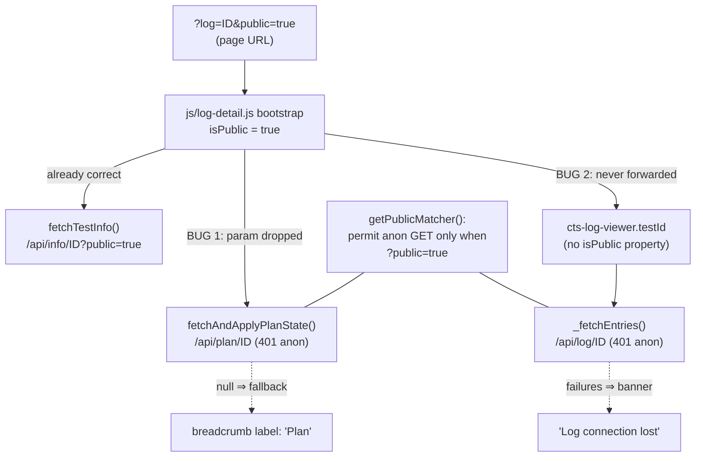

# fix: Thread public=true through log-detail page fetches

## Summary & Problem Frame

On `log-detail.html?log=<id>&public=true`, two defects break the anonymous/public view:

1. **Breadcrumb shows the literal "Plan" label instead of the plan's name.** `fetchAndApplyPlanState()` in `src/main/resources/static/js/log-detail.js` fetches `/api/plan/<id>` without the `public=true` query param. The security filter chain (`WebSecurityResourceServerConfig.getPublicMatcher()`, `src/main/java/net/openid/conformance/security/WebSecurityResourceServerConfig.java`) only permits unauthenticated GETs on `/api/plan/?*` when the `?public` param is present, so anonymous requests get 401, the function returns `null`, and the breadcrumb keeps its optimistic `"Plan"` fallback.
2. **Log entries never load.** `_fetchEntries()` in `src/main/resources/static/components/cts-log-viewer.js` fetches `/api/log/<id>` with no public-awareness at all — the component has no `isPublic` property. Anonymous requests 401, and after repeated failures the viewer shows the "Log connection lost" banner instead of entries.

Both are the same defect class: missing `public=true` propagation in the new Lit-triad page. The backend contract is already consistent (`/api/info/{id}`, `/api/plan/{id}`, `/api/log/{id}` all accept the `public` request param), and `fetchTestInfo()` on the same page already threads it correctly. The institutional solution doc `docs/solutions/web-components/fetch-generation-guard-for-page-driven-components.md` frames this class as a privacy/authorization-visibility concern: the public path must use `?public=true` so the public view renders published data, never the principal's private data.

---

## Requirements

- R1. On `log-detail.html?log=<id>&public=true` for a test in a published plan, the breadcrumb's middle crumb shows the plan's name (resolved from `/api/plan/<id>?public=true`), not the literal "Plan".
- R2. On the same URL, log entries load and render via `/api/log/<id>?public=true`.
- R3. Public threading is consistent across the page: the breadcrumb's root crumb targets (`plans.html` / `logs.html`) carry `?public=true` in public mode, and the page does not poll `/api/runner/<id>` in public mode (public viewers have no runner affordances; unauthenticated runner GETs would 401 on every poll cycle).
- R4. Authenticated non-public behavior is unchanged: no `public` param is added to any request when `?public=true` is absent from the page URL.
- R5. The `"Plan"` fallback label is preserved when the plan fetch fails (e.g., the plan itself is not published even though the test log is).

---

## High-Level Technical Design

Where the `public` param flows today vs. after the fix (directional sketch of the propagation chain, not implementation specification):

After the fix, `fetchAndApplyPlanState` appends `?public=true` when `isPublic`, and the bootstrap sets `viewer.isPublic = true` **before** `viewer.testId` (the `testId` assignment is what triggers the first fetch), so every fetch in the chain matches the public matcher.

---

## Key Technical Decisions

- **Mirror the `cts-log-list` public-awareness pattern.** `cts-log-viewer` gains `isPublic: { type: Boolean, attribute: "is-public" }`, defaulted `false` in the constructor, with a JSDoc `@property` block — exactly the shape `src/main/resources/static/components/cts-log-list.js` already implements. This is the canonical local pattern (established in commit `8dbcdfa37`, "complete the anonymous public browse flow").
- **Compose query params, don't string-append blindly.** `_fetchEntries` already appends `?since=<ts>` on poll cycles. The fix must produce `/api/log/ID?public=true`, `/api/log/ID?since=N`, and `/api/log/ID?public=true&since=N` correctly (e.g., via `URLSearchParams` or equivalent careful suffix logic). A naive `url += "?public=true"` would collide with the `since` suffix.
- **Property-set timing in the bootstrap is load-bearing.** `cts-log-viewer.updated()` kicks off the first fetch when `testId` transitions from empty to set. The precise invariant: `viewer.isPublic` must be assigned in the **same synchronous block** as `viewer.testId` — both land before Lit's batched update flushes, so the first `_fetchEntries` reads the correct scope. Assign `isPublic` first by convention (with a brief inline comment naming the constraint) so the contract is obvious to future editors; what must never happen is deferring the `isPublic` assignment to a later task (e.g., after an `await`). Mirrors the "caller MUST set `is-public` BEFORE invoking" contract `cts-log-list._fetchLogs` documents.
- **Gate the `/api/runner` poll fetch on `!isPublic`, keep the `/api/info` refresh.** `startRunnerPolling` polls both endpoints for non-terminal tests. The runner endpoint has no public mode and would 401 every cycle for anonymous viewers; the in-card slots it feeds (visit-URL prompt, FINAL_ERROR alert) are interaction affordances public viewers don't get. The `/api/info` refresh keeps working so a public viewer of a still-running shared test sees live status updates.
- **Defer the `_fetchSeq` generation guard.** The solution doc recommends a monotonic fetch-generation guard for page-driven components, but its own `applies_when` criteria don't fire here: on log-detail the visibility scope is fixed once per page load, there is no My/Published re-drive, and no `hide()`/reset path. Adding the guard is hardening for a race that cannot occur on this page today — routed to Deferred Follow-Up Work rather than bundled into the fix.

---

## Implementation Units

### U1. Add public-awareness to cts-log-viewer

- **Goal:** `cts-log-viewer` fetches `/api/log/<id>?public=true` when its `is-public` attribute / `isPublic` property is set.
- **Requirements:** R2, R4
- **Dependencies:** none
- **Files:**
  - `src/main/resources/static/components/cts-log-viewer.js` (modify)
  - `src/main/resources/static/components/cts-log-viewer.stories.js` (modify — add public-mode story with play test)
- **Approach:** Add `isPublic: { type: Boolean, attribute: "is-public" }` to `static properties`, default `false` in the constructor, document with a JSDoc `@property {boolean} isPublic` line in the class doc block (matching `cts-log-list.js`'s wording). Rework `_fetchEntries`'s URL construction so `public=true` and `since=<ts>` compose correctly in all four combinations.
- **Patterns to follow:** `cts-log-list.js` — property declaration, constructor default, JSDoc `@property` block, and `publicSuffix` URL threading. Stories file's existing programmable-fetch mock pattern (patching `window.fetch` with `__realFetch` restore in `finally`).
- **Test scenarios:**
  - Happy path: story with `is-public` set — recorded first fetch URL is `/api/log/<id>?public=true`; entries render.
  - Happy path: default story (no `is-public`) — recorded fetch URL contains no `public` param (regression guard for R4).
  - Edge: polling cycle in public mode after entries arrive — recorded poll URL carries both `public=true` and `since=<ts>` as distinct query params.
- **Verification:** New story play test passes via the Storybook test runner; `npm run test:ci` from `frontend/` passes (lint, type-check, jsdoc lint — the new `@property` annotation must satisfy the JSDoc presence lint).

### U2. Thread public=true through the log-detail bootstrap

- **Goal:** The page bootstrap propagates public mode to the plan fetch, the viewer, the breadcrumb root links, and the runner-poll gate.
- **Requirements:** R1, R3, R4, R5
- **Dependencies:** U1 (the bootstrap sets the property U1 introduces)
- **Files:**
  - `src/main/resources/static/js/log-detail.js` (modify)
  - `frontend/e2e/log-detail.spec.js` (modify — add public-mode coverage)
- **Approach:** In `fetchAndApplyPlanState`, append `?public=true` to the `/api/plan/<id>` URL when `isPublic` (same conditional shape as `fetchTestInfo`). In `bootstrap`, set `viewer.isPublic = isPublic` before `viewer.testId = testId`. In `updateBreadcrumb`, thread `?public=true` into the root crumb targets (`/plans.html`, `/logs.html`) when `isPublic` — the middle crumb's `plan-detail.html` target already does this. In `startRunnerPolling`'s `pollOnce`, skip the `/api/runner/<id>` fetch (and its slot rendering) when `isPublic`, leaving the `/api/info` refresh and the terminal-check loop intact.
- **Patterns to follow:** `fetchTestInfo`'s existing `(isPublic ? "?public=true" : "")` conditional; commit `8dbcdfa37`'s e2e additions in `frontend/e2e/plans.spec.js` / `logs.spec.js` (route-recording assertions that requests carry `public=true`); existing route helpers in `frontend/e2e/helpers/routes.js` (`setupFailFast()` registered first, all routes before `page.goto()`).
- **E2E route-glob caveat:** the existing `setupV2Routes` helper in `frontend/e2e/log-detail.spec.js` registers the plan route as the exact glob `**/api/plan/${planId}` with no trailing wildcard. Playwright globs match the full URL including the query string, so that pattern will NOT match `/api/plan/<id>?public=true` — the request would fall through to the fail-fast catch-all and fail the test. Widen the helper's plan route with a trailing wildcard (matching the convention the `/api/info/<id>*` and `/api/log/<id>**` routes in the same file already use) so both public and non-public requests match the stub.
- **Test scenarios:**
  - Happy path (e2e, public mode): mock `/api/info/<id>` (public), `/api/plan/<id>?public=true` returning `planName`, `/api/log/<id>?public=true` returning entries → breadcrumb middle crumb shows the plan name; log entries render; recorded `/api/plan` and `/api/log` request URLs carry `public=true`.
  - Error path (e2e, public mode): `/api/plan/<id>?public=true` returns 404 → breadcrumb keeps the literal "Plan" label (R5; public-mode variant of the existing non-public 404 fallback test).
  - Edge (e2e, public mode, non-terminal test): `/api/info` reports a running status → no request to `/api/runner/<id>` is recorded (R3 runner gate).
  - Edge (e2e, public mode): root crumb button's `data-target` is `/plans.html?public=true` for a planned test (R3 link threading).
  - Regression (existing tests): all current non-public log-detail specs stay green — no `public` param appears in their recorded URLs (R4).
- **Verification:** `cd frontend && ./node_modules/.bin/playwright test e2e/log-detail.spec.js` passes including the new public-mode tests; full `npm run test:e2e` has no new failures beyond the documented pre-existing baseline (5 e2e failures as of 2026-05-29).

---

## Assumptions

- The runner-poll gate and breadcrumb root-link threading are in scope: they are same-class public-mode defects on the same page, and the user's report ("the logs aren't loading in that page, also fix that") frames the page's public mode broadly. Both are small, contained changes in the same file the breadcrumb fix touches.
- The `_fetchSeq` generation guard from the solution doc is out of scope (criteria don't fire on this page) — see Key Technical Decisions and Deferred Follow-Up Work.
- A test published individually whose parent plan is not published renders the `"Plan"` fallback by design (the public plan fetch 404s); no UX change is proposed for that case.

---

## Scope Boundaries

**In scope:** the two reported public-mode defects plus the two same-class threading gaps on the same page (root crumb links, runner-poll gate).

**Non-goals:**

- No backend changes — `/api/plan/{id}`, `/api/log/{id}`, and the security matcher already support public mode correctly.
- No changes to `plan-detail.html` or other pages' public threading (completed in commit `8dbcdfa37`).
- No redesign of the breadcrumb's optimistic-render-then-update flow.

### Deferred to Follow-Up Work

- Port the `_fetchSeq` fetch-generation guard (per `docs/solutions/web-components/fetch-generation-guard-for-page-driven-components.md`) to `cts-log-viewer._fetchEntries` if the component ever gains a re-drive path (scope flip, `hide()`, or testId swap mid-flight). Today the log-detail page sets scope once per load, so the race the guard prevents cannot occur.
- Consider capturing the `getPublicMatcher()` "permit anonymous GET only when `?public=true`" contract as a `docs/solutions/` learning — it is undocumented and this is the second defect cluster caused by it.

---

## Sources & Research

- `src/main/resources/static/js/log-detail.js` — `fetchAndApplyPlanState` (missing param), `updateBreadcrumb` (fallback label), `bootstrap` (viewer wiring), `startRunnerPolling` (runner poll).
- `src/main/resources/static/components/cts-log-viewer.js` — `_fetchEntries` URL construction; `updated()` first-fetch trigger on `testId` assignment.
- `src/main/resources/static/components/cts-log-list.js` — canonical `isPublic` property + URL threading pattern.
- `src/main/java/net/openid/conformance/security/WebSecurityResourceServerConfig.java` — `getPublicMatcher()` permits anonymous GETs on `/api/info/?*`, `/api/plan/?*`, `/api/log/?*` only with `?public=true` (`PublicRequestMatcher` parses the value via `Boolean.parseBoolean`; mere presence is not enough).
- `src/main/java/net/openid/conformance/info/TestPlanApi.java` — `getTestPlan` routes `public=true` to `planService.getPublicPlan(id)`; `src/main/java/net/openid/conformance/info/PublicPlan.java` carries `planName`.
- `src/main/java/net/openid/conformance/logging/LogApi.java` — `getLogResults` accepts the `public` request param.
- Commit `8dbcdfa37` — prior unit of the same initiative (plans/logs pages); log-detail was the remaining gap.
- `docs/solutions/web-components/fetch-generation-guard-for-page-driven-components.md` — defect-class framing and the deferred guard recommendation.
- `frontend/e2e/log-detail.spec.js` — existing breadcrumb fallback test ("breadcrumb keeps literal \"Plan\" label when /api/plan returns 404") and route-mocking conventions.
