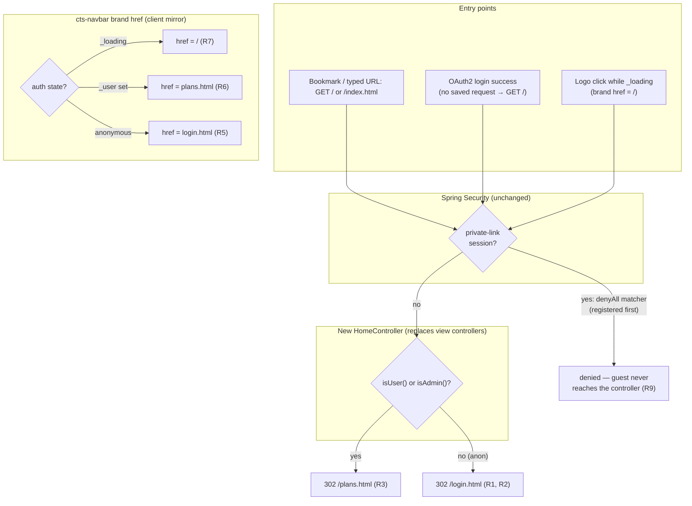

# fix: Logged-out visitors land on login.html from site root and navbar logo

## Summary

Logged-out visitors who arrive at the site root (`/` or the legacy
`/index.html`) or click the navbar logo (the `.cts-brand navbar-brand` anchor
in `cts-navbar`) should land on `login.html`, not `plans.html`. Authenticated
users keep landing on `plans.html`. This reverses one product decision from
the plans-page-as-home work (anonymous landing = public plans view) while
preserving its siblings: anonymous public browsing via `?public=true` nav
links, the anonymous URL canonicalisation on bare `plans.html`/`logs.html`,
and login.html's "browse without signing in" links all stay.

---

## Problem Frame

The plans-home slice (`docs/plans/2026-05-29-001-feat-plans-home-backend-routing-plan.md`)
registered unconditional Spring 302 redirects `/` → `/plans.html` and
`/index.html` → `/plans.html` (`ApplicationConfig.addViewControllers`,
`src/main/java/net/openid/conformance/ApplicationConfig.java:81-93`) and made
those routes `permitAll`, so anonymous visitors land on the public plans
view. The navbar brand is hard-coded `href="plans.html"`
(`src/main/resources/static/components/cts-navbar.js:867`).

The user now wants logged-out arrivals to see the login page first. Two
mechanisms must change together:

1. **Server routing** — the view-controller redirects are static and cannot
   branch on auth state. They must be replaced by an auth-aware handler.
2. **Navbar brand** — the logo href must vary with auth state, which the
   component already tracks (`this._user` from its `/api/currentuser` probe).

A load-bearing constraint discovered in research: OAuth2 login uses the
default `SavedRequestAwareAuthenticationSuccessHandler`, and with no saved
request its fallback target is `/`. A freshly-authenticated user therefore
hits `/` immediately after login — `/` must keep sending *authenticated*
users to `plans.html` or fresh logins would bounce back to the login page.

---

## Requirements

**Server routing**

- R1. Anonymous `GET /` receives a temporary redirect to `/login.html`.
- R2. Anonymous `GET /index.html` behaves identically to `/` (same handler).
- R3. Authenticated (`ROLE_USER` or `ROLE_ADMIN`) `GET /` or `/index.html`
  receives a temporary redirect to `/plans.html` — preserving the OAuth2
  post-login landing, whose default success target is `/`.
- R4. The redirects are 302 (or 303), never 301 — a permanent redirect would
  be browser-cached and freeze the auth-conditional routing.

**Navbar logo**

- R5. For a logged-out visitor, the brand anchor points at `login.html`.
- R6. For an authenticated user, the brand anchor points at `plans.html`
  (unchanged).
- R7. While the navbar's auth state is unresolved (`_loading`, first-ever
  load with no sessionStorage seed), the brand points at `/` so the server
  controller — not a stale client guess — decides the destination.

**Preserved behavior**

- R8. Anonymous public browsing is untouched: `PUBLIC_NAV_LINKS` keep their
  `?public=true` hrefs, anonymous bare `plans.html`/`logs.html` still
  canonicalise client-side to `?public=true`, and login.html's "browse
  without signing in" links keep working.
- R9. Private-link (OTT guest) restriction is unchanged: the `denyAll`
  matcher still stops guests before `/` resolves, and their shared
  `log-detail`/`plan-detail` pages keep working.
- R10. The `/api/*` authorization boundary is untouched — no security
  matcher changes, comment updates only.

---

## Key Technical Decisions

- **KTD1 — Auth-aware redirect lives in a server `@Controller`, replacing the
  view-controller registrations.** `addRedirectViewController` mappings are
  static; they cannot read the `SecurityContext`. A small controller mapped to
  `/` and `/index.html` injects `AuthenticationFacade` (the project's standard
  abstraction — pattern: `src/main/java/net/openid/conformance/ui/UserInfoUIController.java`)
  and branches. A client-side-only fix was rejected: OAuth2 login lands on `/`
  with no client involved, so the server must own the decision.

- **KTD2 — Binary branch: `isUser() || isAdmin()` → `/plans.html`, else
  `/login.html`.** `OIDCAuthenticationFacade` implements these as authority
  checks (`ROLE_USER`/`ROLE_ADMIN`), so anonymous sessions and private-link
  guests (`ROLE_PRIVATE_LINK_USER`) both fall to the login branch naturally —
  no unreachable third branch. Private-link sessions cannot reach the
  controller anyway: the private-link `denyAll` matcher
  (`WebSecurityOidcLoginConfig.java:177-228`) is registered before the
  listing `permitAll` block and first-match-wins, so a guest's `GET /` is
  denied at the filter chain. The controller carries a comment citing that
  ordering so a future matcher reshuffle doesn't silently change guest
  routing.

- **KTD3 — 302 FOUND, never 301.** Same status the retired view controllers
  used. A 301 would be cached by browsers, so a previously-anonymous visitor
  who later logs in would keep being redirected to `login.html` from `/`.

- **KTD4 — Brand href is a three-state client-side expression.**
  `_loading` → `/` (delegate to the server controller); `this._user` →
  `plans.html`; otherwise → `login.html`. This mirrors how `_renderAccount()`
  already treats loading as a distinct state (skeleton, not Sign-in), and
  closes the first-load window where an authenticated user clicking the logo
  mid-probe would be misrouted to login.html. On login.html itself the navbar
  forces `_user = null, _loading = false` without probing, so the brand is a
  harmless self-link there.

- **KTD5 — No security-matcher changes.** `/` and `/index.html` stay in the
  unconditional `permitAll` block (`WebSecurityOidcLoginConfig.java:242-248`)
  so anonymous requests reach the controller. Only the stale comment above
  that block (lines 230-241, which still describes "302 -> /plans.html via
  ApplicationConfig view controllers") is updated. This keeps the
  security-review surface to comments only.

- **KTD6 — No redirect-away from login.html for already-authenticated
  visitors.** The navbar deliberately skips the auth probe on login.html
  (avoids guaranteed-401 log noise); adding a probe back to bounce authed
  visitors would reintroduce it. An authenticated user can still sit on
  login.html — pre-existing, accepted, deferred (see Scope Boundaries).

- **KTD7 — Stale sessionStorage cache flicker is accepted.** If the session
  expired since the navbar cached the user, the brand briefly points at
  `plans.html`; clicking it loads the public shell, the page's own probe
  401s, and the UI self-heals to anonymous within one tick. Documented so a
  future "fix" doesn't reintroduce the My-tab flash the cache seed prevents.

---

## High-Level Technical Design

Routing decision after the change — every entry point to "home" funnels
through one auth-aware decision on the server, plus the client-side brand
mirror:

Public browsing (R8) never passes through `/`: the anonymous nav links and
canonicalisation target `plans.html?public=true` / `logs.html?public=true`
directly, so they are structurally unaffected.

---

## Implementation Units

### U1. Auth-aware home controller replaces the static view-controller redirects

**Goal:** `GET /` and `GET /index.html` 302 to `/login.html` for anonymous
visitors and `/plans.html` for authenticated users.

**Requirements:** R1, R2, R3, R4, R9, R10.

**Dependencies:** none.

**Files:**
- `src/main/java/net/openid/conformance/ui/HomeController.java` *(new)* — a
  `@Controller` with a single handler mapped to both `/` and `/index.html`,
  injecting `AuthenticationFacade`, returning a 302 redirect per KTD2/KTD3.
  Carry over the routing rationale comment from
  `ApplicationConfig.addViewControllers` (bookmarks, OAuth/OTT landing,
  welcome-page history) and add the private-link `denyAll`-ordering note.
- `src/main/java/net/openid/conformance/ApplicationConfig.java` — remove the
  `addViewControllers` override entirely (lines 81-93 contain only the two
  home redirects) and any imports it alone used (`ViewControllerRegistry`,
  `HttpStatus` if now unused).
- `src/main/java/net/openid/conformance/security/WebSecurityOidcLoginConfig.java`
  — comment-only update (lines 230-241): the listing-permit rationale should
  now say `/` and `/index.html` resolve via the auth-aware `HomeController`
  (anonymous → login.html, authenticated → plans.html) and must stay
  `permitAll` so anonymous requests reach it.
- `src/test/java/net/openid/conformance/ui/HomeController_UnitTest.java`
  *(new)* — pure unit test, no Spring context (repo convention: there is no
  MockMvc/`@SpringBootTest` infrastructure; see
  `frontend/e2e/plans-url-compat.spec.js:20-39`).

**Approach:** Mirror `UserInfoUIController`'s shape (`@Controller` +
`@Autowired AuthenticationFacade`). The branch is `isUser() || isAdmin()` —
not `getContextAuthentication() != null`, which would misclassify Spring's
`AnonymousAuthenticationToken` and private-link tokens as logged-in. Ensure
the redirect mechanism produces 302 (the `redirect:` view-name prefix or an
explicit `ResponseEntity`/`RedirectView` — implementer's choice, asserted in
the unit test where the mechanism makes it observable). Annotated controller
mappings take precedence over (now-removed) view controllers, and
`static/index.html` no longer exists, so the controller is the sole owner of
both paths. Build must stay clean under `-Werror`, PMD, checkstyle, ArchUnit.

**Patterns to follow:** `UserInfoUIController.java` (facade injection,
controller shape); `StaticAssetExemption_UnitTest.java` /
`PathMatchingTest.java` (no-Spring-context unit-test style).

**Test scenarios:**
- Authenticated user (`isUser()` true): handler returns a redirect targeting
  `/plans.html`.
- Admin: redirect targets `/plans.html`. Note the dev-profile dummy admin
  carries BOTH `ROLE_USER` and `ROLE_ADMIN` (`DummyUserFilter.java:63-65`),
  so use an `isAdmin()`-only mock variant to prove the OR's second operand —
  but do not label it the dummy-admin shape.
- Anonymous (all facade checks false): redirect targets `/login.html`.
- Private-link guest (`isPrivateLinkUser()` true, others false): redirect
  targets `/login.html` — defensive posture; in production the `denyAll`
  matcher stops the request before the controller (assert the behavior, and
  keep the comment explaining why this branch is normally unreachable).
- Both `/` and `/index.html` map to the same handler (assert via the mapping
  annotation or by invoking the shared method for both paths).
- Redirect is temporary: assert 302/`redirect:` semantics, not a permanent
  redirect (R4).

**Verification:** `mvn test -Dtest=HomeController_UnitTest` green, full
`mvn test` green (JDK 21). Live smoke is the only full-stack check (no
server-test infra): with the dev profile (always admin), `/` lands on
`plans.html`; restarted with `--fintechlabs.devmode=false`, anonymous `/` and
`/index.html` land on `login.html`, and logging in via OAuth lands on
`plans.html` (R3 — the OAuth success → `/` → plans chain).

---

### U2. Auth-conditional navbar brand href

**Goal:** The logo click sends logged-out visitors to `login.html`,
authenticated users to `plans.html`, and unresolved (loading) sessions to `/`.

**Requirements:** R5, R6, R7.

**Dependencies:** U1 (the `/` fallback in the loading state relies on the
auth-aware controller).

**Files:**
- `src/main/resources/static/components/cts-navbar.js` — brand anchor
  (line ~867): replace the hard-coded `href="plans.html"` with the
  three-state expression (KTD4). Update the U9 design comment (lines 7-17,
  "reached via the brand logo") and the class JSDoc to document the brand
  contract per auth state.
- `src/main/resources/static/components/cts-navbar.stories.js` — update the
  brand-href play assertions: `Authenticated` (line ~164, stays
  `plans.html`), `Unauthenticated` (line ~261, becomes `login.html`),
  `DesignSystemStructure` (lines ~704-713, adjust only if it asserts the
  href). Extend the existing `Loading` story (`cts-navbar.stories.js:265`,
  which uses `withMockUser(MOCK_USER, { delay: 60000 })` to pin the loading
  state and already asserts the skeleton avatar) with a brand-href assertion
  that the brand points at `/` — do not add a second `Loading` export.

**Approach:** Pure template change in `render()` reading existing state
(`_loading`, `_user`) — no new probe, no new properties, no events. The
login.html special case (navbar forces anonymous without probing) needs no
code: it yields `_loading = false, _user = null` → brand self-links to
login.html, which is correct. Maintain JSDoc `@property` annotations
(project convention) — no new properties expected, but the class doc block
gains the brand-state contract.

**Patterns to follow:** the `_renderAccount()` three-state handling
(loading skeleton / Sign-in / avatar) in the same file; existing stories'
mocked-fetch play-test structure. Every cts-* component change requires
Storybook play coverage (project convention).

**Test scenarios:**
- Authenticated story: brand href is `plans.html` (regression guard, R6).
- Unauthenticated story: brand href is `login.html` (R5); public nav links
  still carry `?public=true` (R8 regression guard, existing assertions).
- Loading story (existing, delayed-resolve probe): brand href is `/` while
  the account zone shows the skeleton (R7).
- Sign-in action still points at `login.html` in the unauthenticated story
  (existing assertion, unchanged).

**Verification:** Storybook test runner green for `cts-navbar` stories
(restart the daemon if selectors that render live at :6006 fail — known
stale-cache mode); `cd frontend && npm run test:ci` green (lint, type-check,
jsdoc, lit-analyzer).

---

### U3. E2E coverage and the `/`-contract fixme

**Goal:** Page-level assertions cover both auth states of the brand, and the
e2e suite's documentation of the `/` contract reflects the new auth-aware
behavior.

**Requirements:** R5, R6 (page level); documents R1-R3.

**Dependencies:** U2 (asserts the new brand behavior).

**Files:**
- `frontend/e2e/login.spec.js` — extend `cts-navbar renders in
  unauthenticated state` (lines ~128-141) to assert the brand anchor href is
  `login.html`.
- `frontend/e2e/plans.spec.js` (or the spec that already exercises an
  authenticated navbar with a mocked `/api/currentuser` 200) — assert the
  brand href is `plans.html` for an authenticated user.
- `frontend/e2e/plans-url-compat.spec.js` — update the Group-B `test.fixme`
  (line ~134) and its header comment: the `/` contract is now *auth-aware*
  (anonymous → 302 `login.html`, authenticated → 302 `plans.html`, owned by
  `HomeController`); the static `http-server` harness still cannot exercise a
  Spring redirect, so it stays `test.fixme` with live smoke as the named
  verification.

**Approach:** Follow the established conventions: `setupFailFast()` first,
all `page.route()` registrations before `page.goto()`, `/api/currentuser`
mocked → 401 for anonymous and → 200 user JSON for authenticated, assertions
scoped to `page.locator("cts-navbar")`. No new spec files — these are
assertions added to existing tests.

**Patterns to follow:** existing route mocks in `login.spec.js`;
`frontend/e2e/helpers/routes.js` ordering rules; the
`docs/solutions/best-practices/playwright-route-pattern-with-fallback-is-safe-2026-04-17.md`
guidance if route globs overlap.

**Test scenarios:**
- Anonymous page load (mocked 401): brand href `login.html`; nav links keep
  `?public=true`; "Sign in" present.
- Authenticated page load (mocked user): brand href `plans.html`; "My" nav
  hrefs stay bare.
- Existing e2e baseline stays at 0 failures (the 2026-06-03 baseline: any
  e2e failure is a regression).

**Verification:** `cd frontend && ./node_modules/.bin/playwright test
e2e/login.spec.js e2e/plans.spec.js e2e/plans-url-compat.spec.js` green;
full `npm run test:e2e` green.

---

## Assumptions

- "Arrive on the site" means the root entry points (`/`, `/index.html`) and
  the logo click — not direct deep links. Anonymous visits to bare
  `plans.html`/`logs.html` keep canonicalising to `?public=true` (the public
  browse experience shipped on 2026-06-03 stays).
- `/index.html` is treated identically to `/` — it is the legacy home alias
  with no independent meaning.
- The server-rendered Thymeleaf templates (`templates/resultCaptured.html`,
  `error.html`, `implicitCallback.html`) keep their logo `href="plans.html"`:
  they render mid-test-flow to almost-always-authenticated users, and the
  user scoped the ask to the `cts-brand navbar-brand` component.
  `error.html:49`'s `href="/"` footer link now resolves auth-aware, which is
  strictly better.
- Logout already lands on `/login.html` (`logoutSuccessUrl`) — no change
  needed; the new behavior makes arrival and logout symmetric.
- A private-link guest's navbar renders as authenticated (brand →
  `plans.html`, which the denyAll matcher blocks with a 403 if clicked).
  Pre-existing behavior, unchanged by this plan.

---

## Scope Boundaries

**In scope:** the three units above — auth-aware `/` + `/index.html`
controller, three-state brand href, and test coverage.

**Out of scope (not regressions, intentionally untouched):**
- Changing anonymous deep-link behavior on `plans.html`/`logs.html`
  (`?public=true` canonicalisation stays).
- Any `/api/*` security matcher or the private-link `denyAll` matcher.
- The Thymeleaf template logo links.
- The OTT token-generation success target (`/plans.html` — authenticated by
  then) and the OTT auth success handler (shared-asset URL).

### Deferred to Follow-Up Work

- **Redirect already-authenticated visitors away from login.html.** Needs an
  auth probe on login.html, which the navbar deliberately avoids (guaranteed
  401 noise). If user reports show authed users confused by landing on
  login.html (e.g., via the brand mid-loading click before U2's `/`
  fallback existed, or stale bookmarks), revisit with a server-side approach.
- **Private-link guest navbar affordances.** A guest's navbar advertises
  links the denyAll matcher blocks (brand, Test Plans). A guest-aware navbar
  (suppress or retarget links when `isGuest`) is a separate UX question.

---

## Risks & Dependencies

| Risk | Likelihood | Impact | Mitigation |
|------|-----------|--------|------------|
| OAuth post-login landing regresses (login → `/` → login loop) | Low | High | KTD2's authed branch covers the OAuth default target; U1 live smoke explicitly checks the login → plans chain; unit test asserts the authed redirect. |
| 301 caching freezes routing | Low | Medium | KTD3 + R4; unit test asserts temporary-redirect semantics. |
| Brand misroutes authed users during first-load probe | Medium without KTD4 | Low | Three-state href (R7) delegates the ambiguous state to the server; Loading story pins it. |
| Server routing unverifiable in CI (no MockMvc infra; e2e harness is static-only; dev profile always-admin) | Certain | Medium | Unit-test the controller branch logic without a context; live smoke with `--fintechlabs.devmode=false` for the anonymous path (documented in U1 verification); fixme comment names the gap honestly. |
| Storybook/e2e baseline noise blamed on this change | Medium | Low | Baselines are currently clean (e2e 0 failures as of 2026-06-03); reproduce any failure on HEAD before attributing. |

---

## Sources & Research

- `src/main/resources/static/components/cts-navbar.js:867` — hard-coded brand
  href; `:580-674` — auth state machine (`_loading`, `_user`, sessionStorage
  seed, login.html short-circuit).
- `src/main/java/net/openid/conformance/ApplicationConfig.java:81-93` — the
  view-controller redirects being replaced (comment text worth carrying over).
- `src/main/java/net/openid/conformance/security/WebSecurityOidcLoginConfig.java`
  — `:135-138` entry point (`login.html`); `:177-228` private-link `denyAll`
  (registered before the listing permit, first-match-wins); `:230-248`
  listing `permitAll` + stale comment; `:282` OTT token-generation target;
  `:303+` `oauth2Login` with **no** custom success handler → Spring's default
  saved-request handler with `/` fallback (the critical dependency).
- `src/main/java/net/openid/conformance/security/OIDCAuthenticationFacade.java:72-84`
  — `isUser`/`isAdmin`/`isPrivateLinkUser` are authority checks; anonymous
  tokens fail all three.
- `src/main/java/net/openid/conformance/ui/UserInfoUIController.java` —
  controller + facade pattern to mirror.
- `frontend/e2e/plans-url-compat.spec.js:20-39,134` — documents the absence
  of server-test infrastructure and carries the `/`-contract fixme.
- Prior plans: `docs/plans/2026-05-29-001-feat-plans-home-backend-routing-plan.md`
  (the decision being partially reversed),
  `docs/plans/2026-06-03-002-fix-logged-out-public-plans-logs-plan.md`
  (the public-browse behavior being preserved).
- Institutional learnings: navbar FOUC validation caveat
  (`docs/solutions/web-components/cts-navbar-inline-visibility-bug-2026-04-24.md`
  — don't validate navbar changes only on login.html), e2e auth-mock
  conventions
  (`docs/solutions/test-failures/playwright-e2e-flaky-after-web-component-merge-2026-04-14.md`).
