# feat: Inline validate-config feedback with button loading state

## Summary

Replace the toast-based "Validate Configuration" verdict in `cts-config-form` with a brief (~1s) loading state on the button followed by an inline result message rendered next to it. Fix the corrupted `login_hint` tooltip in the config field catalog (stray `</cts-icon>`). The `cts-toast` component stays — it has a live consumer outside this flow.

## Problem Frame

Clicking "Validate Configuration" on `schedule-test.html` runs a synchronous client-side required-fields pass and announces the verdict via a bottom-right toast. Two problems:

1. **No perceived response at the click point.** Validation completes instantly, so nothing visibly changes where the user is looking. The toast lands in the bottom-right corner — far from the user's fovea at the moment of the click — so the verdict is easily missed entirely. The fix: a brief loading state on the button itself (so the click visibly "took"), then the verdict rendered inline next to the button (inside the user's attention locus).
2. **Corrupted tooltip data.** The `login_hint` field's tooltip renders as `…default value ('buffy@<your issuer></cts-icon>') will be used.` The Bootstrap-icon-to-cts-icon migration (commit `0dd20bd84`) mangled the tooltip in `schedule-test.html` — its rewrite misread the literal `<your issuer>` inside the tooltip attribute as an open tag — and the vendoring commit `bcf747f41` then carried the already-corrupted string into `config-field-catalog.json`. The canonical text on `master` (`src/main/resources/static/schedule-test.html:551`) is `('buffy@<your issuer>')`.

The user's request included a conditional: delete `cts-toast` and all associated code/tests if this change makes it useless. Research resolved the conditional to **keep**: `upload.html` still fires an "Image uploaded" toast (`window.ctsToast`, `upload.html:114`), and the toast host is mounted on 10 pages under a deliberate cross-page contract (`docs/residual-review-findings/2026-05-19-cts-toast-cross-page-379767a39.md`).

---

## Requirements

**Validation feedback**

- R1. Clicking "Validate Configuration" (or submitting the form via Enter) immediately puts the button into its loading state for ~1 second before any verdict appears; re-entrant submits during the window are ignored. Starting a re-validation clears any displayed verdict at the moment the loading window opens, so the verdict region is empty for the entire window.
- R2. When the loading window ends, the validation verdict renders inline next to the button. The verdict is a single-line message (status icon + text): `Configuration is valid` on a clean pass, or the existing count-pluralized error copy (`N required field(s) are missing. See inline errors.`) on a failure. Inline per-field `.oidf-error` markers continue to light up exactly as today.
- R3. The verdict is announced to assistive technology via a polite live region that exists in the DOM before the verdict is injected; while loading, the Validate button carries an accessible name change (e.g. `Validating configuration…`) so screen-reader users get acknowledgment at the click moment.
- R4. A displayed verdict clears as soon as the configuration changes — form field edit, JSON-tab edit, or programmatic `config` reassignment from the host page (e.g. Load Last Configuration) — so a stale "valid" claim never sits next to a different config.
- R5. The `cts-validate` event still fires with `{ valid, errors, config }` after the loading window resolves, preserving the documented host-page extension seam.

**Toast disposition**

- R6. `cts-config-form.js` no longer imports or calls `CtsToastHost`. The `cts-toast` component, `js/cts-toast-api.js`, page mounts, and `cts-toast` stories/tests remain untouched (live consumer: `upload.html`).
- R7. The two validate Storybook stories assert the inline surface (loading transition + verdict message) instead of querying `cts-toast-host`; story names and stale toast-rationale comments are updated to match.

**Data fix**

- R8. The `login_hint` tooltip in `src/main/resources/static/js/config-field-catalog.json` reads `…default value ('buffy@<your issuer>') will be used.` — the stray `</cts-icon>` is removed and no other catalog entry contains component markup.

---

## Key Technical Decisions

- **Keep `cts-toast`; remove only the component-local usage.** The deletion conditional in the request resolves to "no": `upload.html` is a live consumer, and the cross-page `cts-toast-host` mount contract is deliberately maintained with e2e presence assertions on every wired page. Touching the mounts would ripple through 9+ specs for zero user value. Only `cts-config-form.js`'s import and two `CtsToastHost.show` calls go.
- **Use `cts-button`'s native `loading` property, bound from a new `_validating` internal state.** `loading` reflects to an attribute (e2e can assert `[loading]`), renders the standard ring spinner, disables the inner button, and suppresses `cts-click` — so double-click protection comes for free. The button is Lit-rendered inside the component, so bind `?loading=${this._validating}` in the template rather than reaching for it by id (host-vs-inner-button convention, `docs/solutions/web-components/cts-button-host-vs-inner-button-semantics-2026-04-17.md`).
- **The ~1s delay is a named module constant; verdict, errors, and event all land when it resolves.** Validation is synchronous — the delay exists purely so the click has a perceptible acknowledgment. Compute `_validateConfig()`, assign `this.errors`, dispatch `cts-validate`, and reveal the inline verdict together when the timer resolves (not before), so the spinner stopping and the verdict appearing are one coherent moment. No code in the repo consumes `cts-validate` outside the component and its stories, so the timing shift is contract-safe. Guard the timer against component disconnection.
- **Verdict region is a persistent polite live region (`role="status"`) inside `.oidf-config-form-actions`.** A validation summary is "standard" urgency (toast/banner analog → polite announcement, per current accessibility guidance); `role="status"` carries implicit `aria-live="polite"`. The node renders empty until a verdict exists — live regions must pre-exist their first update to announce reliably. Carry a stable `data-testid` for story/e2e hooks, mirroring the JSON-tab error precedent (`oidf-config-form-json-error`).
- **Styling mirrors existing inline-feedback precedents, tokens only.** Success: `color: var(--status-pass)` with a `check-big` `cts-icon` (mirrors `.share-modal-success`, `css/oidf-app.css`). Error: `color: var(--rust-500)` with a `circle-warning` `cts-icon` (mirrors `.oidf-error` in `cts-form-field.js`, which uses the darker rust for text). Icons inherit `currentColor`; both names are vendored (verified against `vendor/coolicons/icons/`). New CSS lands in the component's existing `STYLE_TEXT` block. Conditional classes via `classMap` (already imported) — no string-concatenated class names.
- **Accepted trade-off: keyboard focus drops while the button is loading.** `cts-button`'s loading state disables the inner button, which drops focus to `<body>` for keyboard users. This matches the established `#loadLastConfigBtn` behavior on the same page, the window is ~1s, and the `role="status"` region announces the outcome. Diverging from the shared button semantics for this one call site is not worth the inconsistency. To compensate at the click moment (the spinner SVG is `aria-hidden`), bind an accessible-name change on the button while validating — `cts-button` already forwards `ariaLabel` to the inner native button, so `aria-label=${this._validating ? "Validating configuration…" : nothing}` needs no component change.
- **Verdict is Form-tab-scoped UI; tab switches don't clear it.** The Validate button and the verdict region live inside the Form tab panel's actions row (pre-existing button placement, unchanged). Validation runs against `this.config`, which both tabs keep in sync, so the verdict stays accurate across a Form ↔ JSON switch; only config *changes* clear it (R4). The JSON tab keeps its own parse-error surface (`oidf-config-form-json-error`), untouched.
- **The catalog fix is a hand-edit.** `config-field-catalog.json` has no generator (no codegen step covers it; `frontend/scripts/codegen.sh` is API-types only). The tooltip is consumed as a plain string by the adapter, so the corrected value renders literally. No test pins the string.

---

## High-Level Technical Design

Validate-flow state machine inside `cts-config-form` (directional guidance, not implementation specification):

```mermaid
stateDiagram-v2
    [*] --> Idle
    Idle --> Validating: form submit / button click
    Validating --> Validating: re-entrant submit (ignored)
    Validating --> VerdictShown: delay (~1s) resolves -> compute errors, set this.errors, fire cts-validate, render inline verdict
    VerdictShown --> Idle: config change (field/JSON edit or programmatic config reassignment) clears verdict
    VerdictShown --> Validating: form submit (re-validate; verdict clears as the window opens)
```

---

## Implementation Units

### U1. Fix the corrupted login_hint tooltip in the config field catalog

- **Goal:** The `login_hint` help text renders the intended default `('buffy@<your issuer>')` with no leaked component markup.
- **Requirements:** R8
- **Dependencies:** none
- **Files:** `src/main/resources/static/js/config-field-catalog.json`
- **Approach:** Remove the literal `</cts-icon>` from the tooltip string at the `login_hint` entry (line ~206), restoring the canonical text from `master`'s `schedule-test.html:551`. Confirm via search that no other catalog entry contains `cts-icon` or other element markup (current count: exactly one).
- **Patterns to follow:** none needed — one-line data correction.
- **Test scenarios:** Test expectation: none — data-only fix; no existing test pins catalog tooltip strings (checked `src/main/resources/static/components/config-form-adapter.test.js`), and adding a string-pinning test for one tooltip would be assertion overkill by repo convention.
- **Verification:** A search for `cts-icon` in `config-field-catalog.json` returns nothing; the schedule-test form's `login_hint` help text shows `('buffy@<your issuer>')`.

### U2. Inline verdict + loading state in cts-config-form, stories rewritten

- **Goal:** The Validate Configuration flow shows a ~1s button loading state, then an inline verdict next to the button; toasts are gone from the component; Storybook play tests cover the new surface.
- **Requirements:** R1, R2, R3, R4, R5, R6, R7
- **Dependencies:** none
- **Files:** `src/main/resources/static/components/cts-config-form.js`, `src/main/resources/static/components/cts-config-form.stories.js`
- **Approach:**
  - Add internal reactive state: `_validating` (boolean) and a verdict holder (e.g. `_validateResult: null | { valid, count }`). These are private internal state — document them in the class JSDoc prose, not as `@property` tags (those are for the public reflected API; `lint:jsdoc` checks public properties only).
  - `_handleValidate` keeps `e.preventDefault()`; early-return when `_validating`; clear any displayed verdict and set `_validating = true`; after the named-constant delay (~1000 ms), compute `_validateConfig()`, assign `this.errors`, dispatch `cts-validate`, set the verdict state, clear `_validating`. Cancel the pending timer in `disconnectedCallback`.
  - Bind `?loading=${this._validating}` and `aria-label=${this._validating ? "Validating configuration…" : nothing}` on the Validate `cts-button`.
  - Render the persistent `role="status"` verdict node as a sibling of the button inside `.oidf-config-form-actions` (already a centered flex row with `gap: var(--space-3)`); empty until a verdict exists; success/error variants via `classMap`; pinned copy — success: `Configuration is valid` (single line; the toast's body sentence is redundant at the action-row level), error: the toast's existing count-pluralized copy verbatim (`${count} required ${count === 1 ? "field is" : "fields are"} missing. See inline errors.`); `cts-icon` glyphs `check-big` / `circle-warning`.
  - Narrow-viewport behavior: let the actions row wrap (`flex-wrap: wrap`) so a long error verdict drops below the button at full width rather than overflowing; no truncation.
  - Clear the verdict (set holder to null) in `_handleFieldChange`, `_handleJsonInput`, and the existing `willUpdate` external-config branch (`changedProperties.has("config") && !changedProperties.has("_jsonText")`) so programmatic `.config` reassignment — `schedule-test.html` does this in four places, including Load Last Configuration — also drops a stale verdict.
  - Drop the `CtsToastHost` import (line 7) and both `CtsToastHost.show` calls.
  - Update the class JSDoc `## Validate Configuration` block (toast prose → loading + inline verdict, including the delay and event timing); add an `@fires cts-validate` tag (the live component documents only `@fires cts-config-change`).
  - Stories: rewrite all three toast-asserting validate stories — `ValidateButtonShowsSuccessToast`, `ValidateButtonShowsErrorToast`, and `ValidateButtonIgnoresHiddenRequiredFields` (lines ~430-489, which preserves unique hidden-required-field-exclusion coverage and must migrate to the inline surface, not be deleted) — renaming the first two to message-oriented names; delete the now-unused `resetToastHost()` helper and its stale rationale comment once no caller remains in this file (`cts-toast.stories.js` has its own copy and is untouched).
  - Story timing discipline: every `waitFor` that gates on post-delay state (verdict visible, `cts-validate` fired) must pass an explicit `{ timeout }` at least 3x the delay constant (e.g. 3000 ms) — storybook/test's default 1000 ms timeout races the ~1000 ms delay at the same boundary; the `waitForJsonEditor` helper in this same file already uses `{ timeout: 10000 }` for the same reason.
- **Patterns to follow:** JSON-tab error markup in the same component (`role`, `data-testid`); `.oidf-error` flex row in `cts-form-field.js` for error text styling; `.share-modal-success` in `css/oidf-app.css` for the success row; `loadLastConfigBtn` loading toggle in `schedule-test.html` for the set/clear discipline; `storybook/test` `waitFor` for async story assertions (no fake timers exist in this codebase — keep real waits, assert state transitions rather than wall-clock).
- **Test scenarios (Storybook play functions):**
  - Happy path: with all required fields filled, click Validate → button gains `loading` immediately; after the window, loading clears and the success verdict (`Configuration is valid` + `check-big` icon, `role="status"`) is visible; `cts-validate` fired once with `valid: true` and empty `errors`; zero `.oidf-error` markers.
  - Error path: with required fields missing, click Validate → after the window, the error verdict names the missing count; `this.errors`-driven `.oidf-error` markers light up; `cts-validate` fired with `valid: false` and the expected error map.
  - Verdict timing: immediately after click (while loading), no verdict text is present — verdict and spinner-stop arrive together; re-validating from a shown verdict empties the region for the whole window.
  - Stale-verdict clearing: after a verdict is shown, editing any form field clears the verdict text; same via a JSON-tab edit; same via a programmatic `.config` reassignment on the component (the Load Last Configuration path).
  - Hidden-field exclusion (migrated story): hidden required fields are excluded from validation and the success verdict shows inline (preserves `ValidateButtonIgnoresHiddenRequiredFields` coverage).
  - Re-entrancy: a second submit during the loading window does not queue a second verdict or a second `cts-validate` (single event, single verdict).
- **Verification:** `run-story-tests` passes for all `cts-config-form` stories; `npm run test:ci` from `frontend/` passes (lint, type-check, jsdoc, icons, lit-analyzer); no `CtsToastHost` reference remains in `cts-config-form.js` or its stories.

### U3. Page-level e2e coverage of the new validate flow

- **Goal:** `schedule-test.html` e2e proves the loading transition and inline verdict in the real page context (there is currently zero validate-flow e2e coverage).
- **Requirements:** R1, R2, R4
- **Dependencies:** U2
- **Files:** `frontend/e2e/schedule-test.spec.js`
- **Approach:** Add a small describe-block for the validate flow using the existing mocked-API setup. Follow the established loading-attribute matcher idiom (`toHaveAttribute("loading", /.*/)` / `.not.toHaveAttribute(...)`) used for `#loadLastConfigBtn`. Respect the page's documented init-chain fragility: `setupFailFast()` first, registration order for routes, and `waitForFunction`-style readiness guards before interacting (`docs/solutions/test-failures/playwright-e2e-flaky-after-web-component-merge-2026-04-14.md`).
- **Test scenarios (Playwright):**
  - Incomplete config: click Validate → the button carries `loading`, then settles; the inline verdict (`role="status"` / `data-testid`) becomes visible with the missing-field count.
  - Complete config: fill the required fields, click Validate → success verdict visible next to the button; no toast element appears in `cts-toast-host`.
  - Stale-verdict clearing: after a verdict shows, type into a field → the verdict disappears.
  - Existing cross-page contract untouched: the spec's `cts-toast-host` presence assertion (`toHaveCount(1)`) continues to pass.
- **Verification:** `npm run test:e2e` (or the single spec via `./node_modules/.bin/playwright test e2e/schedule-test.spec.js`) passes; e2e baseline on `feat/redesign` is 0 failures, so any failure is a regression.

---

## Scope Boundaries

**Non-goals**

- No removal of `cts-toast-host` mounts or `js/cts-toast-api.js` imports from any page — the cross-page toast contract stays as documented.
- No change to `upload.html`'s "Image uploaded" toast.
- No backend validation endpoint (`POST /api/plan/validate` remains a documented future seam via the `cts-validate` event).
- No change to `cts-button`'s loading/disabled semantics (the focus-drop trade-off is accepted, not redesigned).

**Deferred to Follow-Up Work**

- Rename the stale e2e test name `U11: click error shows toast and re-enables the button` (`frontend/e2e/schedule-test.spec.js` ~line 689) — it asserts the legacy `#errorModal`, not a toast; misleading name, unrelated assertion body.
- Audit whether the 8 pages that mount `cts-toast-host` without any toast caller should keep their mounts, or whether the contract should shrink to actual consumers — an architecture decision for the maintainers, not this change.
- Document the "inline status vs toast" decision rule as a convention (good `ce-compound` candidate once this ships; no such convention doc exists today).

---

## Risks & Dependencies

- **Time-coupled test flakiness.** The ~1s window is real time in stories and e2e (no fake timers exist in this codebase). Mitigation: assert state transitions with `waitFor`/web-first assertions, never bare sleeps; keep the delay a named constant so tests can reference intent.
- **Storybook baseline noise.** Some storybook tests have a known pre-existing failure baseline on `feat/redesign`; reproduce any failure on HEAD before attributing it to this change. The Vitest browser daemon can also serve stale modules after edits — restart it if a rewritten story fails on selectors the live Storybook renders correctly.
- **schedule-test.html init-chain fragility.** The page's bootstrap is a documented flake surface for e2e; the U3 approach pins the established mitigations.

---

## Sources & Research

- Component and call sites: `src/main/resources/static/components/cts-config-form.js` (`_handleValidate` ~line 410, toast calls ~423/431, JSDoc block ~lines 86-102, actions row CSS), `src/main/resources/static/components/cts-button.js` (`loading` property, click suppression), `src/main/resources/static/js/cts-toast-api.js`, `src/main/resources/static/upload.html:114` (surviving toast consumer).
- Toast contract history: `docs/residual-review-findings/2026-05-19-cts-toast-cross-page-379767a39.md`, `docs/residual-review-findings/2026-05-19-cts-toast-residuals-fix-fe34323f6.md` (10-page mount contract, presence assertions, time-coupled assertion warning).
- Button semantics: `docs/solutions/web-components/cts-button-host-vs-inner-button-semantics-2026-04-17.md`.
- e2e flake mitigations: `docs/solutions/test-failures/playwright-e2e-flaky-after-web-component-merge-2026-04-14.md`.
- Corruption provenance: canonical text at `master` `src/main/resources/static/schedule-test.html:551`; corruption introduced by the `bi-*` → `cts-icon` migration commit `0dd20bd84`; vendored into the catalog by `bcf747f41`.
- Accessibility guidance (external, load-bearing for the `role="status"` choice): modern-web-guidance accessibility guide — live-region urgency table maps a "Saved"-style status verdict to `polite`; single persistent region per concern; live regions must exist before their first update.
