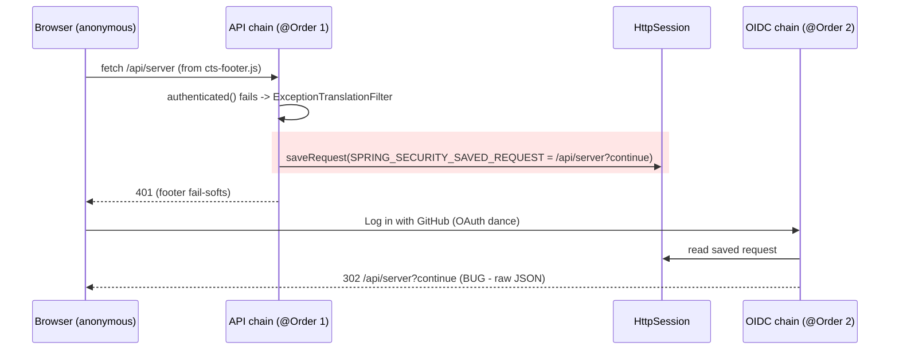

# fix: Stop anonymous API fetches from hijacking the post-login redirect

## Summary

Configure `NullRequestCache` on the API security filter chain so anonymous `fetch()` calls to authenticated `/api/*` endpoints can no longer poison the session's saved-request slot. After GitHub/Google/GitLab OAuth login, users land on `/` → `plans.html` again instead of raw JSON at `/api/server?continue`. Pin the behavior with a regression test that drives the real filter chain.

## Problem Frame

On feat/redesign, logging in with GitHub from `login.html` redirects to `/api/server?continue`, which renders the server-info JSON instead of the plans home. Root cause (fully diagnosed):

1. `login.html` loads `cts-footer.js`, which fires `fetch("/api/server")` on connect to render the footer version line. (`cts-navbar.js` does the same with `/api/currentuser` on other public pages — `plans.html`/`logs.html` anonymous browsing.)
2. `/api/server` requires authentication in the API chain (`WebSecurityResourceServerConfig`). For the anonymous fetch, Spring Security's `ExceptionTranslationFilter` calls `requestCache.saveRequest()` **before** invoking `RestAuthenticationEntryPoint` — the 401 is harmless to the page (the footer fail-softs), but `SPRING_SECURITY_SAVED_REQUEST` is now written into the session. Note the API chain's own `SessionCreationPolicy.NEVER` does not prevent this: the chain's default `HttpSessionRequestCache` has `createSessionAllowed=true`, and Spring Security's `RequestCacheConfigurer` never propagates the `NEVER` policy to the cache (verified against Spring Security 6.5.9 — only `STATELESS` auto-installs a `NullRequestCache`). The write would happen even with no pre-existing session; in practice the OIDC chain's `SessionCreationPolicy.ALWAYS` means one already exists.
3. The two filter chains are separate configs but share one `HttpSession`. On OAuth success, the OIDC chain's default `SavedRequestAwareAuthenticationSuccessHandler` finds the saved request and replays it — `302 /api/server?continue` (`?continue` is Spring Security 6's `matchingRequestParameterName` marker).

Spring Security's default saved-request matcher excludes legacy AJAX (`X-Requested-With: XMLHttpRequest`, `Accept: application/json`) but not native `fetch()`, which sends `Accept: */*`. Master never hit this because its `login.html` made zero API calls; the redesign's componentized chrome (navbar/footer) introduced anonymous API fetches on public pages.

---

## Requirements

- R1. After OAuth login initiated from `login.html`, the browser lands on `/` (which routes authenticated users to `plans.html`) — never on an `/api/*` URL.
- R2. Anonymous requests to authenticated `/api/*` endpoints must not write `SPRING_SECURITY_SAVED_REQUEST` into the session.
- R3. HTML deep-link replay is preserved: an anonymous navigation to a protected page (e.g. `schedule-test.html`), followed by login, still returns the user to that page. (The OIDC chain's request cache is untouched.)
- R4. API authorization behavior is unchanged: anonymous requests to authenticated `/api/*` endpoints still receive 401 via `RestAuthenticationEntryPoint`; public matchers, private-link restrictions, and `denyAll` fallbacks are untouched.
- R5. A regression test pins R2 against the real `filterChainResourceServer` chain, so removing the request-cache configuration fails the build.

---

## High-Level Technical Design

The fix removes the red box: `NullRequestCache` on the API chain makes `saveRequest()` a no-op, so the OAuth success handler falls through to its default URL `/`, and `HomeController` routes the authenticated user to `plans.html`. The OIDC chain keeps its default `HttpSessionRequestCache`, preserving the R3 deep-link flow (HTML page requests are saved by *that* chain, not the API chain).

---

## Key Technical Decisions

- **Fix server-side with `NullRequestCache` on the API chain, not by suppressing the frontend fetches.** A frontend guard (skip the fetch when anonymous) would only fix the two known callers (`cts-footer.js`, `cts-navbar.js`) and leave the session-poisoning footgun armed for the next public-page component that touches `/api/*`. One line in `WebSecurityResourceServerConfig` neutralizes every current and future anonymous API fetch. (Institutional precedent: `docs/solutions/web-components/fetch-generation-guard-for-page-driven-components.md` documents a prior unmodeled side effect of public-page `/api/*` fetches — this is the second instance of that pattern, and the durable fix belongs at the layer where the side effect lives.)
- **Do not touch the OIDC chain's request cache or set `defaultSuccessUrl("/", true)`.** Forcing the success URL would also discard the *legitimate* saved request for protected HTML pages and regress deep-link-after-login (R3). API URLs are never sensible browser navigation targets; HTML pages are.
- **Keep `/api/server` authenticated.** Making it public would "fix" the redirect for this one endpoint but leaks version/revision/external-IP details to anonymous users and does nothing for `/api/currentuser` or future endpoints.
- **Regression-test by driving the real chain, not by asserting configuration via reflection.** Build the `filterChainResourceServer` `SecurityFilterChain` in a minimal Spring context with mocked collaborators, wrap it in a `FilterChainProxy`, send an anonymous `GET /api/server` with a pre-created mock session, and assert both the 401 and the absence of `SPRING_SECURITY_SAVED_REQUEST`. This survives refactors of *how* the cache is disabled. `spring-boot-starter-test` (spring-test mock servlet objects + Mockito) is sufficient; `spring-security-test` is not needed and not on the classpath.

---

## Assumptions

- The change ships on `feat/redesign` through the existing GitLab MR (no separate branch/PR), consistent with how the redesign branch is delivered.
- No flow depends on replaying a saved `/api/*` request after login: the private-link/OTT success handler uses an explicit redirect, logout uses `logoutSuccessUrl`, and XHR/fetch clients handle 401s without replay. (Verified by code search during investigation; called out here because it is the one behavioral bet in this change.)

---

## Implementation Units

### U1. NullRequestCache on the API chain + regression test

**Goal:** Anonymous requests to authenticated `/api/*` endpoints stop writing `SPRING_SECURITY_SAVED_REQUEST`; post-login redirect contract is restored and pinned by a test.

**Requirements:** R1, R2, R3, R4, R5

**Dependencies:** none

**Files:**
- `src/main/java/net/openid/conformance/security/WebSecurityResourceServerConfig.java` — add `http.requestCache(...)` with `NullRequestCache` to `filterChainResourceServer`, with a comment explaining the cross-chain poisoning it prevents (future readers will not guess why an API chain configures a request cache). The comment must also note that the chain's `SessionCreationPolicy.NEVER` does not make this line redundant — Spring auto-installs a `NullRequestCache` only for `STATELESS`, so the explicit configuration is load-bearing and must not be removed as cleanup.
- `src/test/java/net/openid/conformance/security/ResourceServerRequestCache_UnitTest.java` — new regression test.

**Approach:** One logical change: the fix and its regression test land together. The test builds the real `filterChainResourceServer` bean in a minimal annotation-config web context (`@EnableWebSecurity` test configuration importing `WebSecurityResourceServerConfig`, with `AuthenticationFacade`, `DummyUserFilter`, `ApiTokenAuthenticationProvider`, and `ShareJwtBearerAuthenticationProvider` provided as Mockito mocks), wraps the chain in a `FilterChainProxy`, and exercises it with spring-test mock servlet objects. The repo deliberately has no `@SpringBootTest`/MockMvc infrastructure (see `src/test/java/net/openid/conformance/ui/HomeController_UnitTest.java` header), and no existing test builds `HttpSecurity` — this test stays self-contained, boots only the one security config class, and is novel infrastructure for this repo. Mock-setup cautions: the request must carry no bearer token and the mocked token providers must never yield an authenticated principal (or the request-cache path is never reached), and the context must not set `fintechlabs.devmode=true` (the `@Value` default is `false`; `DummyUserFilter` would bypass the 401 path entirely).

Time-box the behavioral-test attempt to one focused session. Fallback if booting `HttpSecurity` outside Spring Boot proves unworkable within the box: extract the chain's `ExceptionTranslationFilter` and assert its request cache is a `NullRequestCache`. Be explicit about what the fallback buys: it satisfies R5 (the configuration cannot silently regress) but does NOT pin R2's behavioral guarantee, and it cannot go red before the fix exists — so if the fallback is taken, the test-first red step is necessarily skipped and the review-app behavioral confirmation in Verification becomes a mandatory completion gate rather than a follow-up.

**Execution note:** Test-first — the saved-request assertion must fail against the current chain (attribute present) before the fix, proving the test observes the bug.

**Patterns to follow:**
- `src/test/java/net/openid/conformance/security/StaticAssetExemption_UnitTest.java` — guard-test style: class javadoc records the regression context so the test doubles as documentation of the invariant.
- `*_UnitTest.java` naming convention; tests compile with `-Werror`, and checkstyle/PMD apply.

**Test scenarios:**
- Anonymous `GET /api/server` (no credentials, fetch-like headers `Accept: */*`, pre-created mock session) → response is 401 AND the session has no `SPRING_SECURITY_SAVED_REQUEST` attribute (the bug's exact mechanism). The session MUST be pre-created: it makes the red step deterministic (attribute present on the pre-created session before the fix) and the green step prove suppression rather than mere absence-of-session.
- Anonymous `GET /api/currentuser` → same assertions (covers the navbar's fetch on anonymous `plans.html`/`logs.html`, guarding against a future endpoint-specific regression).
- Anonymous `GET /api/runner/whatever` (an arbitrary authenticated API path) → 401 and no saved request (proves the protection is chain-wide, not endpoint-specific).
- Negative control: the 401 still comes from the entry point (response not a 302 redirect) — pins R4's "authorization behavior unchanged".

**Verification:** New test fails before the fix and passes after; full `mvn test` (PMD, checkstyle, ArchUnit included) passes; frontend e2e suite unaffected (no static-resource changes). Full-stack confirmation happens on the review app after deploy: GitHub login from `login.html` lands on `plans.html`, and an anonymous visit to a protected HTML page followed by login still returns to that page (R3).

### U2. Capture the cross-chain request-cache learning in docs/solutions

**Goal:** The non-obvious mechanism ("two filter chains share one `HttpSession`; the API chain's saved request poisons the OIDC chain's success handler; native `fetch()` bypasses Spring's AJAX exclusions") survives turnover and is findable by future searchers.

**Requirements:** supports R2 durably (institutional memory; no runtime behavior)

**Dependencies:** U1

**Files:**
- `docs/solutions/best-practices/anonymous-api-fetch-side-effects-request-cache.md` — new solution doc following the frontmatter format of existing docs in `docs/solutions/`.

**Approach:** Document the mechanism precisely — including that `SessionCreationPolicy.NEVER` does not stop the cache write (`createSessionAllowed=true`; only `STATELESS` auto-installs a `NullRequestCache`) — plus the `?continue` diagnostic fingerprint, why the fix is server-side, and the rejected alternatives (frontend suppression, `defaultSuccessUrl`, making `/api/server` public). Cross-reference `docs/solutions/web-components/fetch-generation-guard-for-page-driven-components.md` and name the recurring pattern ("anonymous public-page `/api/*` fetch side effects") so both instances are discoverable together. Note: the local `.git/info/exclude` blocks new `docs/*` files on this machine — the file must be force-added or it will be silently missing from the commit.

**Test scenarios:** Test expectation: none — documentation-only unit.

**Verification:** Doc exists with valid frontmatter matching sibling docs; appears in the commit (not silently excluded).

---

## Scope Boundaries

**In scope:** the API chain's request cache, the regression test, the solution doc.

**Out of scope (deliberate non-goals):**
- Making `/api/server` or `/api/currentuser` anonymous-readable (information disclosure; separate product decision).
- Any change to the OIDC chain's request cache, entry points, or success/failure handlers — HTML deep-link replay must keep working as-is.

### Deferred to Follow-Up Work

- Skip the footer's `/api/server` fetch on `login.html` (mirroring the navbar's skip in `cts-navbar.js`) to cut 401 log noise — pure noise reduction once the poisoning is fixed; independent change.
- The `?continue` query param that HTML deep-link replays carry (e.g. `schedule-test.html?continue`) is pre-existing Spring Security 6 behavior, unrelated to this bug; only worth revisiting if it ever confuses page JS that parses the query string.

---

## Risks

- **A flow silently relying on API-chain saved requests.** Assessed as none (see Assumptions); blast radius is limited to the API chain, and the OIDC chain — where all browser-navigation flows live — is untouched.
- **Test-infrastructure friction.** Booting `HttpSecurity` for one chain outside Spring Boot is the only genuinely uncertain implementation detail; the fallback hierarchy in U1 caps the cost (behavioral assertion preferred, structural assertion acceptable, neither blocks the one-line fix itself).
