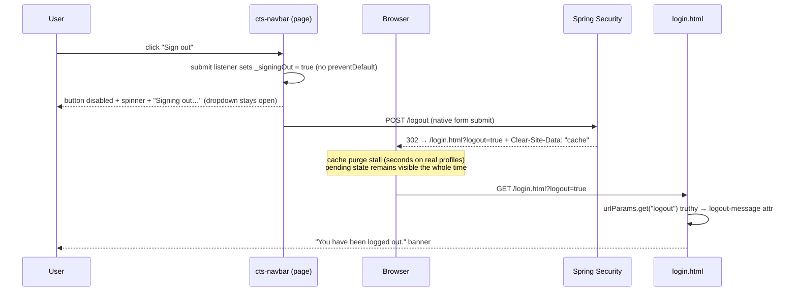

# feat: Sign-out pending state and post-logout confirmation banner

## Summary

Give the navbar's Sign out action immediate, visible feedback (disabled button + spinner + "Signing out…", with the account dropdown staying open), and make the logout redirect carry `?logout=true` so the already-built "You have been logged out." banner on `login.html` finally renders.

---

## Problem Frame

Clicking Sign out in the account dropdown is a plain form POST to `/logout` (`src/main/resources/static/components/cts-navbar.js`). The server responds in ~26ms, but the 302 carries `Clear-Site-Data: "cache"` (added in commit `a4d062965` for shared-machine hardening), which Chrome processes synchronously — on a daily-driver profile the browser-side cache purge stalls the navigation for multiple seconds. During that window the page gives zero feedback: the dropdown sits open, the button looks untouched, and the only signal is the tab spinner.

Compounding it, the post-logout landing is silent: `cts-login-page` has a ready-made `logout-message` banner wired to a `?logout` URL param (`src/main/resources/static/login.html` lines 40–43), but Spring redirects to bare `/login.html`, so the confirmation never shows — it is dead code today.

This plan implements the two UX-layer fixes (pending state + confirmation banner). Removing or replacing the `Clear-Site-Data` stall itself is explicitly deferred (see Scope Boundaries).

---

## Requirements

**Pending feedback**

- R1. Activating Sign out immediately shows a pending state on the button: disabled, label "Signing out…", animated spinner.
- R2. The account dropdown remains open while the sign-out POST is in flight; neither submit, Escape, nor outside-click closes it during the pending window.
- R3. A second activation while pending cannot fire a second `POST /logout`.
- R4. The pending state is conveyed to assistive technology (`aria-busy` on the button), and the spinner respects `prefers-reduced-motion`.

**Post-logout confirmation**

- R5. A successful logout lands on `/login.html?logout=true` and the "You have been logged out." banner renders.

**Invariants**

- R6. Logout semantics are otherwise unchanged: `POST /logout`, session invalidation, the `Clear-Site-Data: "cache"` response header, and no changes to `oauth2Login` success handling or any request-cache configuration.

---

## High-Level Technical Design

The pending state works *because* the form POST is a navigation: the browser keeps rendering the current page (including the Lit re-render with the spinner) until the 302 response is fully processed — which is exactly the stall window the feedback needs to fill.

---

## Key Technical Decisions

- **Sign-out stays a navigating native form POST, not a `fetch()`**: the pending state fills the browser-side stall without taking ownership of redirect handling, and avoids re-importing the request-cache discipline documented in `docs/solutions/best-practices/anonymous-api-fetch-side-effects-request-cache-2026-06-04.md`. A fetch-based flow is a deferred alternative, not part of this plan.
- **Pending state via internal Lit state set in a `submit` listener without `preventDefault`**: `_signingOut: { state: true }` flips on submit; the native POST proceeds; Lit's async re-render lands well before the response arrives. The same listener calls `preventDefault()` when `_signingOut` is already true (double-submit guard, R3).
- **Inline ring-spinner SVG mirroring `cts-button`, not a `cts-icon` glyph**: an animated busy indicator is not a static icon — `cts-button.js` (`.oidf-btn-spinner`, its `@keyframes` and disabled styling) is the in-repo precedent and the documented exception to the "no hand-rolled inline SVG" icon rule. coolicons has no true spinner (`loading.svg` additionally has malformed markup).
- **Dropdown stays open by mechanism, not by accident**: the outside-click close path in `_onDocPointerDown` only fires when the event target is outside `.cts-account`; the sign-out button is inside it, so submitting never closes the menu. The remaining dismissal paths (Escape, outside-click elsewhere on the page) get a `_signingOut` early-return guard so the pending feedback cannot be dismissed mid-flight.
- **`?logout=true`, not bare `?logout`**: `login.html` gates the banner on the truthiness of the param *value* (`urlParams.get("logout")`); a bare `?logout` yields `""` (falsy) and would not trigger it.
- **Backend assertion through Spring's public API, not config reflection**: drive a real `POST /logout` through the `WebSecurityOidcLoginConfig` filter chain and assert `response.getRedirectedUrl()`, following the harness in `src/test/java/net/openid/conformance/security/ResourceServerRequestCache_UnitTest.java` (the lesson from commit `b1b39af10`).
- **No new Lit directive imports**: build the conditional rendering with `when`/`classMap`, which `cts-navbar` already imports — new `lit/directives/*` specifiers would require importmap entries on every page embedding the navbar (`docs/solutions/best-practices/lit-directives-via-importmap-vendored-bundle-2026-04-18.md`).

---

## Implementation Units

### U1. Sign-out pending state in cts-navbar

- **Goal:** Clicking Sign out instantly shows a disabled, spinner-bearing "Signing out…" button while the dropdown stays open.
- **Requirements:** R1, R2, R3, R4
- **Dependencies:** none
- **Files:**
  - `src/main/resources/static/components/cts-navbar.js`
  - `src/main/resources/static/components/cts-navbar.stories.js`
- **Approach:**
  - Add `_signingOut: { state: true }` to `static properties` (underscore-internal state needs no JSDoc `@property`).
  - Add a `@submit` handler on `.cts-account-form`: if `_signingOut` is already true, `preventDefault()` and return; otherwise set `_signingOut = true` and let the native submit proceed.
  - In the sign-out button markup: bind `?disabled=${this._signingOut}` and `aria-busy=${this._signingOut ? "true" : "false"}` (string-valued attribute binding — `aria-busy` is an ARIA string attribute, not a boolean HTML attribute, so a `?aria-busy` boolean binding would emit an invalid empty value), swap the label to "Signing out…" plus an inline ring-spinner SVG when pending (use the already-imported `when` directive). Keep `type="submit"`, `role="menuitem"`, and the `cts-account-item cts-account-item--danger` classes. Native `disabled` briefly drops focus to `<body>` at activation — an accepted trade since navigation is imminent.
  - In the component's `STYLE_TEXT`: add a `:disabled` rule for `.cts-account-item` (mirror `cts-button`'s `opacity: 0.55; cursor: not-allowed`), the spinner size/animation rules, and extend the existing `@media (prefers-reduced-motion: reduce)` block so the ring does not spin (static or pulse fallback, matching `cts-spinner`'s convention). Stroke the spinner with `currentColor` (not `cts-button`'s `--orange-400` head) so it inherits the danger item's text colour.
  - Guard the `_menuOpen = false` dismissal paths in `_onDocPointerDown` and `_onDocKeydown` with an early `if (this._signingOut) return;` so neither outside-click nor Escape can close the dropdown mid-sign-out (R2). Make no other changes to the document-level handlers.
  - Reset `_signingOut = false` in a `pageshow` listener so a bfcache Back-restore can never present a frozen, disabled "Signing out…" button (belt-and-suspenders next to the `Clear-Site-Data` bfcache eviction).
- **Patterns to follow:** `src/main/resources/static/components/cts-button.js` (`loading` → disabled binding, `_renderIcon` spinner SVG, `.oidf-btn-spinner` CSS, click guard); `cts-batch-runner.js` (`?disabled=${this._running}` reactive disable); story conventions in `cts-navbar.stories.js` (`withMockUser` decorator, synthetic `pointerdown` to avoid iframe teardown).
- **Test scenarios** (Storybook play functions):
  - Open the account menu, attach a one-shot `submit` listener that calls `preventDefault()` (keeps the Storybook iframe alive — the only divergence from production), click Sign out: button is disabled, label contains "Signing out", spinner element present, menu still open (`.cts-account[data-open="true"]`).
  - While pending, attempting a second click on the disabled button does not fire a second submit (listener call count stays 1).
  - Dispatch a synthetic `submit` event on the form while `_signingOut` is already true and assert `defaultPrevented === true` — this exercises the R3 guard directly; the play function's own iframe-safety `preventDefault()` listener cannot stand in for it.
  - Press Escape while pending: the menu stays open (`data-open` remains `"true"`).
  - The geometry guard `expectAccountMenuItemsWithinMenu` stays green with the new button content.
  - Existing `AccountMenuOpens` assertions (`action="/logout"`, `method="post"`) stay green.
- **Verification:** Storybook interaction tests pass (`npx vitest --project=storybook --run` from `frontend/`); `npm run test:ci` (format, lint, type-check, lint:icons) passes — note the spinner is inline SVG, so `lint:icons` is not implicated.

### U2. Logout redirect lands on /login.html?logout=true

- **Goal:** Activate the existing post-logout confirmation banner by making Spring's logout redirect carry the param `login.html` already reads.
- **Requirements:** R5, R6
- **Dependencies:** none
- **Files:**
  - `src/main/java/net/openid/conformance/security/WebSecurityOidcLoginConfig.java`
  - `src/test/java/net/openid/conformance/security/OidcLogoutRedirect_UnitTest.java` (new)
- **Approach:**
  - Change `logout.logoutSuccessUrl("/login.html")` to `logout.logoutSuccessUrl("/login.html?logout=true")` (currently line 371). Update the adjacent comment if it references the bare URL.
  - Touch nothing else in this file — in particular no `oauth2Login` success handling and no request-cache configuration (guardrails from `docs/solutions/best-practices/anonymous-api-fetch-side-effects-request-cache-2026-06-04.md`).
  - New unit test bootstraps a minimal `AnnotationConfigWebApplicationContext` importing `WebSecurityOidcLoginConfig` with mocked collaborator beans, wraps the `SecurityFilterChain` in a `FilterChainProxy`, drives `POST /logout` with `MockHttpServletRequest`/`MockHttpServletResponse`, and asserts on the response.
- **Execution note:** If `WebSecurityOidcLoginConfig`'s collaborator surface proves too heavy to bootstrap in a minimal test context, do not build a brittle mega-mock — fall back to the e2e journey (U3) as the behavioral assertion and record the gap in the test class javadoc.
- **Patterns to follow:** `src/test/java/net/openid/conformance/security/ResourceServerRequestCache_UnitTest.java` (context bootstrap, `FilterChainProxy` drive, public-API assertions).
- **Test scenarios:**
  - `POST /logout` with an authenticated session → 302 and `response.getRedirectedUrl()` equals `/login.html?logout=true`.
  - The response still carries the `Clear-Site-Data: "cache"` header (regression guard for commit `a4d062965`).
- **Verification:** `mvn test -Dtest=OidcLogoutRedirect_UnitTest` passes; full `mvn test` stays green.

### U3. E2E journey: sign out shows pending state, lands on the banner

- **Goal:** Cross-layer proof that the authenticated navbar's form POST, the redirect param, and the banner compose correctly.
- **Requirements:** R1, R2, R5
- **Dependencies:** U1 (pending state markup), U2 (redirect target the mock mirrors)
- **Files:**
  - `frontend/e2e/journeys.spec.js` (cross-page flows live here per repo convention)
- **Approach:**
  - Start from `plans.html` (the authenticated home). `setupFailFast(page)` first, then the common journey route setup used by existing `journeys.spec.js` tests (covering `/api/server` — fetched by `cts-footer` on every page, including the post-logout `login.html` landing — and friends), plus an authenticated `/api/currentuser` so the account menu renders. Hand-mocking only `/api/currentuser` would trip `setupFailFast`/`expectNoUnmockedCalls` after the redirect.
  - Route `**/logout` with a deliberately delayed `route.fulfill({ status: 302, headers: { location: "/login.html?logout=true" } })` — the delay (~300ms) creates a deterministic window to assert the pending state. Use `route.fallback()` for non-POST methods with a one-line comment (per `docs/solutions/best-practices/playwright-route-pattern-with-fallback-is-safe-2026-04-17.md`).
  - Scope navbar assertions to the `cts-navbar` locator (strict-mode lesson from `docs/solutions/test-failures/playwright-e2e-flaky-after-web-component-merge-2026-04-14.md`).
- **Test scenarios:**
  - From `plans.html`, open the account menu and click Sign out: while the POST is in flight, the button is disabled with label "Signing out…" and the dropdown is still open.
  - Navigation lands on `/login.html?logout=true` and the logout banner (`cts-login-page .oidf-alert-info`) is visible with "You have been logged out."
- **Verification:** `cd frontend && ./node_modules/.bin/playwright test e2e/journeys.spec.js` passes; full `npm run test:e2e` stays green (existing `login.spec.js` banner test at lines 117–126 already covers the banner-on-param half and must remain green).

---

## Scope Boundaries

**Deferred to follow-up work**

- **Replacing `Clear-Site-Data: "cache"` with `pageshow`-based session re-validation** (eliminates the multi-second stall at its source). This reverts part of a one-day-old security hardening commit and needs core-maintainer sign-off on the threat-model trade-off; it should be proposed separately with the investigation evidence.
- **Fetch-based sign-out** (pending state without full-page navigation). Only worth considering if the navigating-form pending state proves insufficient; it would take ownership of redirect handling and re-import the request-cache contract.

**Non-goals**

- No changes to login/OAuth success handling, session policy, CSRF posture, or the `Clear-Site-Data` logout handler itself.
- No visual redesign of the account dropdown beyond the pending state.

---

## Sources & Research

- Investigation evidence (this plan's origin): server-side `POST /logout` measured at ~26ms and a clean-profile browser logout at ~162ms, vs. 5+ seconds reported on a real profile — isolating the stall to the browser-side `Clear-Site-Data` cache purge introduced in commit `a4d062965` (2026-06-03).
- `src/main/resources/static/components/cts-navbar.js` — light-DOM Lit component; `_menuOpen` state; outside-click/Escape close handlers; sign-out form markup (~line 836).
- `src/main/resources/static/components/cts-button.js` — in-button spinner + disabled precedent.
- `src/main/resources/static/login.html` (lines 30–44) and `src/main/resources/static/components/cts-login-page.js` (`logout-message` property, `_renderLogout`) — the dormant banner path.
- `frontend/e2e/login.spec.js` (lines 117–126) — existing passing test for the banner at `?logout=true`.
- `docs/solutions/best-practices/anonymous-api-fetch-side-effects-request-cache-2026-06-04.md` — request-cache contract guardrails for `WebSecurityOidcLoginConfig`.
- `docs/solutions/web-components/cts-button-host-vs-inner-button-semantics-2026-04-17.md` — keep the sign-out control a native `<button type="submit">`.
- `docs/solutions/best-practices/lit-directives-via-importmap-vendored-bundle-2026-04-18.md` — importmap constraint on new Lit directive imports.
- `docs/solutions/test-failures/playwright-e2e-flaky-after-web-component-merge-2026-04-14.md` and `docs/solutions/best-practices/playwright-route-pattern-with-fallback-is-safe-2026-04-17.md` — e2e mocking and selector conventions.
