# feat: Celebrate the login page with confetti and falling emojis

## Summary

Add a one-shot, decorative celebration to the login landing page: a short confetti
burst plus emoji glyphs falling down the screen when the page loads. The effect is
delivered as a new reusable, dependency-free `cts-confetti` overlay component that the
login page mounts. It is purely presentational — non-interactive, `aria-hidden`, and
fully suppressed for users who prefer reduced motion. No new vendored dependency, no
build step.

---

## Problem Frame

The redesigned login page (`cts-login-page`) is functional and on-brand but visually
quiet. The request is to add "pezaz" — confetti and emojis going down the screen on
load — to give first contact with the suite a moment of delight.

The constraints that make this non-trivial in *this* codebase:

- **Accessibility is non-negotiable.** The page already gates its entrance animation
  behind `prefers-reduced-motion: reduce` (`cts-login-page.js:90`). A burst of confetti
  and falling emoji is exactly the kind of motion that reduced-motion users opt out of,
  so the celebration MUST honour the same media query.
- **No new dependencies / no build step.** `CLAUDE.md` is explicit: vendored libraries
  are pinned and curated, and "Do NOT add a build step." A canvas-confetti npm package
  is the wrong fit; the effect should be hand-rolled and self-contained.
- **Component + Storybook conventions.** Every `cts-*` component must ship Storybook play
  tests, use light DOM with an injected `<style id>` block (the dominant convention,
  40/49 components), carry JSDoc `@property` annotations, and avoid dynamic class
  concatenation.
- **It must not break the form.** The overlay must never intercept clicks on the OAuth
  buttons, and it must not fire on the error or token-auth (hidden-iframe) code paths,
  where a celebration would be inappropriate or invisible.

This is a self-contained frontend change confined to `src/main/resources/static/`. No
backend, no Java, no protocol behaviour is touched.

---

## Requirements

- **R1.** On a normal load of the login page, a confetti burst and a stream of falling
  emoji play once, then clean themselves up.
- **R2.** When `prefers-reduced-motion: reduce` is set, no confetti, no falling emoji,
  and no animated DOM nodes are produced at all.
- **R3.** The effect never blocks interaction: the overlay is `pointer-events: none` and
  the OAuth buttons / public-resource links remain clickable throughout.
- **R4.** The effect is decorative-only to assistive tech: the overlay is `aria-hidden`
  and contributes nothing to the accessibility tree.
- **R5.** The celebration fires only on a **clean arrival** at the login page. It does
  **not** fire when the URL carries an `error`, `logout`, or `token` parameter (failed
  sign-in, post-logout, or token-auth hidden-iframe flow). The clean-load decision is made
  in `login.html` — which already interprets those params — and is **not** inferred from
  component state after render (see KTD7 for the timing reason).
- **R6.** No new vendored dependency and no build step are introduced; the effect is
  self-contained vanilla JS + CSS using existing design tokens for confetti colour.
- **R7.** The new component ships with Storybook play tests and passes all existing
  frontend quality gates (`format:check`, `lint`, `type-check`, `lint:jsdoc`,
  `lint:icons`, `lint:lit-analyzer`) and the login E2E spec.

---

## Key Technical Decisions

### KTD1 — Hand-rolled effect, no library

Build the confetti + emoji rain by hand rather than vendoring `canvas-confetti` or
similar. Rationale: the project's vendoring discipline is deliberate and a build step is
forbidden (`CLAUDE.md` Key Dependencies). A one-shot burst is ~80 short-lived nodes —
trivially hand-rollable with CSS keyframes and inline per-piece custom properties. This
also matches the institutional preference for *frontend-only / minimal* solutions over
new coupled dependencies (see auto-memory: "Minimal backend touching", "package.json
exact versions").

### KTD2 — DOM + CSS keyframes, not `<canvas>`

Spawn each confetti piece and each emoji as an absolutely-positioned element inside a
fixed overlay, animated with a single shared CSS `@keyframes` fall and randomised per
piece via inline CSS custom properties (`--x`, `--drift`, `--fall-dur`, `--delay`,
`--spin`). Rationale: emoji glyphs render natively as text (drawing emoji to a canvas is
finicky and platform-dependent), animations run on `transform`/`opacity` only (compositor
-friendly), and cleanup is a single timeout plus `disconnectedCallback`. Canvas would add
a rAF loop and manual emoji rasterisation for no benefit at this scale.

### KTD3 — A dedicated `cts-confetti` component, not inline login code

Implement the engine as a standalone `cts-confetti` web component that the login page
mounts, rather than burying the animation inside `cts-login-page.js`. Rationale: the repo
mandates Storybook play tests per component; isolating the effect lets it be tested
deterministically without the OAuth page scaffolding, keeps the login component focused,
and gives a clean seam (the *effect* is generic; the login page decides *when* to fire
it).

Alternatives considered:
- **Inline private methods on `cts-login-page`** — rejected: couples a generic visual
  effect to one page and makes it testable only through the whole login surface.
- **A plain exported helper module** (`spawnConfetti()` / cleanup fn, no custom element) —
  a legitimately lighter option that still allows isolated testing, and it is the honest
  YAGNI counter-argument since there is exactly one call site today. It is **not** chosen
  because the repo's unit of composition is the `cts-*` web component with a colocated
  Storybook story + play tests (the per-component test mandate in `CLAUDE.md`); a helper
  module would be the only animated UI surface in the suite without that harness. The
  component is the convention-aligned choice; the helper module is the fallback if
  maintainers prefer to defer the abstraction.

### KTD4 — Light DOM with injected `<style id>` block

Follow the dominant component convention (`createRenderRoot() { return this; }` + a
guarded `injectStyles()` appending a `<style id="cts-confetti-styles">`), exactly as
`cts-login-page.js:349` does. Rationale: consistency with 40/49 existing components; the
overlay is `position: fixed` so it does not need Shadow DOM encapsulation, and a single
shared keyframe injected once is cheaper than per-instance shadow styles.

### KTD5 — Reduced-motion checked at fire time; `disabled` for opt-out; **both** paths tested

The component reads `window.matchMedia("(prefers-reduced-motion: reduce)").matches` when
deciding whether to spawn, and also accepts an explicit `disabled` boolean attribute as a
hard opt-out. These are **two distinct branches** and each gets its own test: the
`disabled` story exercises the opt-out path, and a dedicated story that **mocks
`window.matchMedia` to return `matches: true`** exercises the real reduced-motion gate
(R2). The `disabled` story does **not** stand in for reduced-motion — the distinguishing
behaviour of R2 *is* the `matchMedia` call, so an inverted condition or wrong query string
would pass a `disabled`-only test while shipping motion to opted-out users. There is an
in-repo precedent for mocking `matchMedia` in stories: `cts-flash-highlight.stories.js`
(save/restore pattern). Headless CI Chromium reports `no-preference`, so the default
"pieces spawn" path is also deterministic.

### KTD6 — Fires on every clean load; error/logout/token arrivals excluded; no session suppression yet

The request is "on load," so the effect fires on every clean arrival at the login page.
Crucially, the clean-load gate (KTD7 / R5) already **excludes** the high-frequency
annoyance vectors: a failed sign-in (`?error=`), a post-logout redirect (`?logout=`), and
the token-auth flow (`?token=`) all suppress the celebration — so a user retrying a flaky
login does **not** get confetti on every bounce, and a logout is never "celebrated."
Once-per-session suppression via `sessionStorage` (suppressing even repeated *clean*
reloads within a session) remains deferred (see Scope Boundaries) — a plausible follow-up
if even clean-reload repetition proves tiresome, but the literal request is "on load" and
the main annoyance cases are already handled.

### KTD7 — `login.html` owns the celebrate decision (fixes a first-render timing race)

`cts-login-page` defaults `celebrate = false`; `login.html` opts in by setting the
`celebrate` attribute **only** on a clean load. Rationale: deferred `type=module` scripts
upgrade the element and Lit flushes its first `render()` **before** `DOMContentLoaded`
runs — and `login.html` sets the `error`/`token`/`logout-message` attributes inside a
`DOMContentLoaded` handler (`login.html:31`). If `celebrate` defaulted `true` and the gate
relied on `!this.error`, the first render would evaluate the gate with `error` still empty,
mount `<cts-confetti>`, and fire the one-shot burst *before* the error attribute arrived to
suppress it — `cts-confetti` does not re-evaluate on later property changes, so the burst
would already have played. Flipping the default to `false` makes the **safe** state the
initial state: first render shows nothing; only after `login.html` confirms a clean load
(no `error`/`logout`/`token` params, which it already parses) does it set `celebrate`,
triggering a re-render that mounts and fires the effect once. This also removes any reliance
on `this.tokenAuthUrl` for suppression — which never worked for the production token path
anyway, since `login.html` drives that flow via its own `document.body` iframe and never
sets the component's `token-auth-url`.

---

## High-Level Technical Design

The clean-load decision lives in `login.html` (it already parses the URL params); the
component only renders confetti when told to. `celebrate` defaults **false** so the safe
state is the initial state (see KTD7).

```mermaid
flowchart TD
    A[login.html DOMContentLoaded parses URL params] --> B{error / logout / token param present?}
    B -- yes --> X[Leave celebrate=false: no cts-confetti ever mounts]
    B -- no --> C[Set celebrate attribute on cts-login-page]
    C --> D[cts-login-page re-renders, mounts &lt;cts-confetti&gt;]
    D --> E[cts-confetti connectedCallback]
    E --> F{disabled OR prefers-reduced-motion: reduce?}
    F -- yes --> G[Empty overlay, spawn nothing]
    F -- no --> H[Spawn confetti + emoji burst]
    H --> I[Single timeout = max&#40;delay+fall-dur&#41; + buffer removes overlay]
    E -. disconnectedCallback .-> J[Clear timeout, remove overlay nodes]
```

`cts-confetti` internal lifecycle: on connect → guard (`disabled` OR reduced-motion → no
spawn) → build the confetti pieces + emoji, each with randomised inline custom properties
(clamped so no piece's `delay + fall-dur` exceeds `BASE_DURATION + MAX_DELAY`), append to a
fixed `pointer-events:none` `aria-hidden` overlay → set one cleanup timeout sized to the
actual longest `delay + fall-dur` plus a buffer. On disconnect → clear timeout, drop nodes.

---

## Implementation Units

### U1. Create the `cts-confetti` overlay component

**Goal:** A reusable, dependency-free decorative overlay that plays a one-shot confetti +
falling-emoji burst on connect and cleans itself up.

**Requirements:** R1, R2, R3, R4, R6.

**Dependencies:** none.

**Files:**
- `src/main/resources/static/components/cts-confetti.js` (new)

**Approach:**
- Lit `LitElement`, light DOM (`createRenderRoot() { return this; }`), guarded
  `injectStyles()` appending `<style id="cts-confetti-styles">` — mirror the structure of
  `cts-login-page.js:349-355`.
- **Committed default constants** (named module-level consts, not approximations):
  - `CONFETTI_PIECES = 60`, `EMOJI_PIECES = 15` (75 short-lived nodes total).
  - `BASE_DURATION = 2400` (ms fall time), `MAX_DELAY = 1200` (ms max per-piece start
    delay), `BUFFER = 200` (ms cleanup safety margin).
  - Total visible window ≈ `BASE_DURATION + MAX_DELAY` ≈ 3600 ms.
- Properties (with JSDoc `@property` annotations per repo convention), each defaulting to
  the constants above so callers rarely need to set them:
  - `pieces` (Number, default `CONFETTI_PIECES`) — confetti count.
  - `emojis` (String, default `"🎉 🎊 ✨ 🥳 🔑 🛡️ ✅ 🚀"`) — whitespace-separated glyphs to
    rain (`EMOJI_PIECES` are sampled from this set).
  - `duration` (Number ms, default `BASE_DURATION`) — base fall duration.
  - `disabled` (Boolean, reflected attribute) — hard off-switch for tests/opt-out.
- On `connectedCallback`: call `injectStyles()`, then `_celebrate()`.
- `_celebrate()`: return early if `this.disabled` OR
  `window.matchMedia("(prefers-reduced-motion: reduce)").matches`. Otherwise build a
  fixed-position overlay `
` (`aria-hidden="true"`, `pointer-events:none`,
  full-viewport, `z-index: 900`) and append confetti ``s (token-coloured rectangles)
  and emoji ``s. Randomise each piece via inline CSS custom properties
  (`--x` start %, `--drift` horizontal end offset, `--fall-dur`, `--delay`, `--spin`
  rotation). **Clamp** randomisation so `delay + fall-dur ≤ BASE_DURATION + MAX_DELAY` for
  every piece. Use `Math.random()` (browser runtime — fine here).
- **z-index: 900** — above page content and the layout overflow popover (`z-index: 750`),
  deliberately **below** the navbar and toast host (both `z-index: 1000`, see
  `cts-navbar.js:335`, `cts-toast.js:47`) so confetti appears to fall out from under the
  header and never covers a toast (e.g. the post-logout banner stays on top).
- Single shared `@keyframes cts-confetti-fall` translating from above the viewport to
  below it with horizontal drift + rotation. Each piece caps at `opacity: 0.85` and fades
  to `0` over the **last 30%** of its fall, so the form stays legible throughout. Confetti
  fill colours are drawn from this explicit token list (no status-palette tokens, no
  hardcoded hex): `--orange-300`, `--orange-400`, `--orange-500`, `--sand-300`,
  `--sand-200`, `--ink-300`.
- Cleanup: one `setTimeout` sized to the **actual** longest `delay + fall-dur` across the
  spawned pieces plus `BUFFER` (bounded by `BASE_DURATION + MAX_DELAY + BUFFER` thanks to
  the clamp) removes the overlay; `disconnectedCallback` clears the timeout and removes the
  overlay (prevents Storybook cross-story timer bleed and DevTools-restart leaks).
- No `cts-icon` usage (emoji are text glyphs), so `lint:icons` is unaffected.

**Patterns to follow:** `cts-login-page.js` (light DOM + injected styles +
reduced-motion media query at `:90`); JSDoc `@property` blocks as in
`cts-login-page.js:357-381`.

**Test scenarios:** covered by U2's Storybook play tests (this unit ships behaviour the
next unit verifies). No standalone unit-test framework exists for these components.

**Verification:** Component module loads without console errors; manually mounting
`<cts-confetti>` produces a visible burst that disappears within ~3s and leaves no
residual DOM; mounting `<cts-confetti disabled>` produces nothing.

---

### U2. Storybook stories + play tests for `cts-confetti`

**Goal:** Deterministic play-test coverage proving the spawn, suppression, safety, and
cleanup contracts.

**Requirements:** R2, R3, R4, R7.

**Dependencies:** U1.

**Files:**
- `src/main/resources/static/components/cts-confetti.stories.js` (new)

**Approach:** Colocated stories (repo convention), `title: "Components/cts-confetti"` —
consistent with the flat `Components/` Storybook IA (the login *page* uses `Pages/`; a
generic component belongs under `Components/`). Stories: `Default` (effect on), `Disabled`
(`disabled` attribute), `ReducedMotion` (mocks `window.matchMedia` → `matches: true`,
restoring it after — mirror the save/restore pattern in `cts-flash-highlight.stories.js`),
and optionally `DenseEmoji` (custom `emojis`/`pieces`). Use `storybook/test` (`expect`,
`within`, `waitFor`) as the existing login stories do.

**Test scenarios:**
- Happy path: `Default` story spawns an overlay element that is present in the DOM after
  mount; the overlay has `aria-hidden="true"`.
- Safety: the overlay computes `pointer-events: none` (`getComputedStyle`) — proves R3.
- Decorative: overlay carries `aria-hidden="true"` and no `role` — proves R4.
- Spawn count: `Default` produces a non-zero number of piece elements; a custom
  `pieces`/`emojis` story reflects the requested counts (sanity, not exact if randomised).
- Off-switch: `Disabled` story (`<cts-confetti disabled>`) renders **zero** piece elements
  / no overlay — proves the `disabled` opt-out.
- Reduced-motion (R2): `ReducedMotion` story mocks `window.matchMedia` to report
  `matches: true`, asserts **zero** pieces spawn, then restores `matchMedia`. This
  exercises the real accessibility gate — the `matchMedia` call itself — which the
  `disabled` path does not reach (an inverted condition or wrong query string would slip
  past a `disabled`-only test). Covers R2.
- Cleanup: after the component is removed (or `disconnectedCallback` invoked), the overlay
  nodes are gone — guards against timer/DOM leaks.

**Verification:** `npx vitest --project=storybook --run` (or storybook MCP
`run-story-tests`) passes for the new stories; the new `cts-confetti` stories appear in the
suite and the total story count increases without regressing existing stories (run the
suite to confirm the post-change count rather than hardcoding a baseline).

---

### U3. Mount the celebration in `cts-login-page`

**Goal:** The login page fires the celebration on normal load, and only then.

**Requirements:** R1, R5, R6.

**Dependencies:** U1.

**Files:**
- `src/main/resources/static/components/cts-login-page.js` (modify)
- `src/main/resources/static/login.html` (modify — owns the clean-load decision)

**Approach:**
- In `cts-login-page.js`: `import "./cts-confetti.js";` alongside the other component
  imports. Add a `celebrate` property (Boolean, **default `false`**, reflected attribute,
  with JSDoc `@property`). In `render()`, conditionally include `<cts-confetti>` inside the
  `oidf-login-page` main when `this.celebrate` is true (Lit conditional
  `${this.celebrate ? html\`...\` : nothing}`, not dynamic classes). Keep `&& !this.error`
  as cheap defense-in-depth, but the authoritative gate is `celebrate`. Update the
  component's class-level JSDoc to mention the celebration overlay and the
  `login.html`-owned trigger.
- In `login.html`: inside the existing `DOMContentLoaded` handler that already reads
  `error` / `logout` / `token` (`login.html:31-82`), set the `celebrate` attribute on
  `loginPage` **only when none of those params are present** (clean arrival). Default-off
  + opt-in-on-clean-load is what fixes the first-render timing race (KTD7): the safe state
  is the initial render, and the celebration is enabled one update cycle later, after the
  params are known.

**Patterns to follow:** existing conditional sub-renders `_renderError()` /
`_renderLogout()` / `_renderTokenIframe()` returning `nothing` when inactive; the existing
`login.html` URL-param → `setAttribute` block.

**Test scenarios:** covered by U4 (login-page story updates). Note: the `login.html` inline
script is exercised by the E2E spec in U5, not by Storybook (stories mount the component
directly and set `.celebrate` themselves).

**Verification:** Loading `login.html` on a clean URL shows the burst (one cycle after
load); loading with `?error=...`, `?logout=true`, or `?token=...` shows **no** burst at
any point (not even a flash); OAuth buttons remain clickable during the effect.

---

### U4. Update login-page stories for the celebration

**Goal:** Keep the existing structural stories deterministic and add explicit celebration
coverage.

**Requirements:** R3, R5, R7.

**Dependencies:** U2, U3.

**Files:**
- `src/main/resources/static/components/cts-login-page.stories.js` (modify)

**Approach:**
- Because `celebrate` now defaults to **false** (U3 / KTD7), the existing structural
  stories (`Default`, `WithError`, `PostLogout`, `TokenAuth`, `ErrorAndLogout`) render with
  no celebration automatically — **no edits needed** to keep them free of overlay/timer
  noise. Leave them as-is.
- Add a new `WithCelebration` story rendering `<cts-login-page .celebrate=${true}>`,
  asserting: a `cts-confetti` element is present, and the OAuth buttons are still reachable
  (no pointer interception). Keep assertions tolerant of randomised piece counts.
- Add a `CelebrationGatedByError` story rendering
  `<cts-login-page error="..." .celebrate=${true}>` to assert the defense-in-depth gate:
  **no** `cts-confetti` mounts even when `celebrate` is true, because `!this.error` blocks
  it (R5).

**Test scenarios:**
- Existing five stories continue to pass unchanged (celebration off by default).
- `WithCelebration`: `cts-confetti` is mounted in the page; "Proceed with Google" anchor
  is present and its closest interactive ancestor is the anchor (not the overlay) — R3.
- Gating: `CelebrationGatedByError` (`error` set, `celebrate` true) renders **no**
  `cts-confetti` — R5.

**Verification:** All `cts-login-page` stories pass; no cross-story flakes from leftover
timers (cleanup from U1 covers this).

---

### U5. Quality gates and E2E verification

**Goal:** Prove the change is green across the frontend gate ladder and the login E2E
path.

**Requirements:** R7.

**Dependencies:** U1, U2, U3, U4.

**Files:**
- `frontend/e2e/login.spec.js` (inspect; modify only if it asserts on DOM the overlay
  perturbs — expected: no change needed since overlay is `aria-hidden` + additive)

**Approach:** Run `npm run test:ci` from `frontend/` (format:check → lint → type-check →
lint:jsdoc → lint:icons → lint:lit-analyzer → codegen:check) and the storybook + e2e
suites. Fix any gate failures (most likely JSDoc `@property` completeness or
lit-analyzer template diagnostics on the new component).

**Test scenarios:** `Test expectation: none — this is a verification/gate unit, not a
behavioural change.` Existing login E2E spec must remain green; if it doesn't, the overlay
is interfering and U1/U3 must be corrected (do not weaken the test).

**Verification:** `cd frontend && npm run test:ci` exits 0; storybook story tests pass;
`./node_modules/.bin/playwright test e2e/login.spec.js` (if present) passes.

---

## Scope Boundaries

**In scope:** a hand-rolled confetti + falling-emoji overlay component, its Storybook
tests, wiring it into the login page with correct gating, and passing all frontend gates.

**Non-goals (outside this product's identity):**
- Celebrating any other page (test pass/fail, certification completion, dashboards). The
  request is the login form specifically.
- Sound effects.
- User-configurable themes / a settings toggle for the effect.

### Deferred to Follow-Up Work
- **Once-per-session suppression** via `sessionStorage` (only celebrate the first login
  view per session). Intentionally omitted — the request is "on load." Revisit only if
  the effect is reported as tiresome.
- **Reusing `cts-confetti` elsewhere** (e.g., a successful certification run). The
  component is built generic enough to allow it, but no second call site is added now.

---

## Risks & Dependencies

- **Risk: motion accessibility regression.** Mitigated by R2 + KTD5 — a dedicated
  `ReducedMotion` story mocks `matchMedia` and asserts zero pieces, exercising the real
  gate (not just the `disabled` proxy).
- **Risk: celebration fires before error/logout/token state is known (first-render race).**
  Mitigated by KTD7 — `celebrate` defaults false and `login.html` opts in only on a clean
  load, so the safe state is the initial render and no burst can flash on an error/logout/
  token arrival.
- **Risk: overlay layers wrong against navbar/toast chrome.** Mitigated by the explicit
  `z-index: 900` (U1) — above page content, below the `1000` navbar and toast host, so the
  post-logout toast and header stay on top.
- **Risk: overlay blocks the form.** Mitigated by `pointer-events: none` (R3) and a
  play-test asserting computed `pointer-events` and button reachability.
- **Risk: Storybook timer bleed across stories.** Mitigated by `disconnectedCallback`
  cleanup (U1) and `.celebrate=false` on structural login stories (U4).
- **Risk: emoji rendering varies by platform.** Accepted — emoji are decorative; visual
  variance across OSes is fine for a celebratory flourish.
- **Dependency:** none external. Uses existing Lit vendor bundle and design tokens.

---

## Sources & Research

- `src/main/resources/static/components/cts-login-page.js` — host component, light-DOM +
  injected-style convention, existing `prefers-reduced-motion` gate (`:90`), conditional
  sub-render pattern.
- `src/main/resources/static/components/cts-login-page.stories.js` — Storybook play-test
  conventions to mirror.
- `src/main/resources/static/css/oidf-tokens.css` — motion tokens (`--dur-1/2/3`,
  `--ease-standard/emphasized`) and orange/sand colour ramps for confetti fill.
- `CLAUDE.md` — no-build-step / vendoring discipline, component & badge & icon
  conventions, frontend quality-gate ladder, Storybook play-test mandate.
- Project auto-memory — "Minimal backend touching", "JSDoc annotations", "Component
  conventions", "Storybook interaction tests", "Browser support policy" (latest evergreen
  browsers only → no polyfills needed for `matchMedia` / CSS custom properties).
