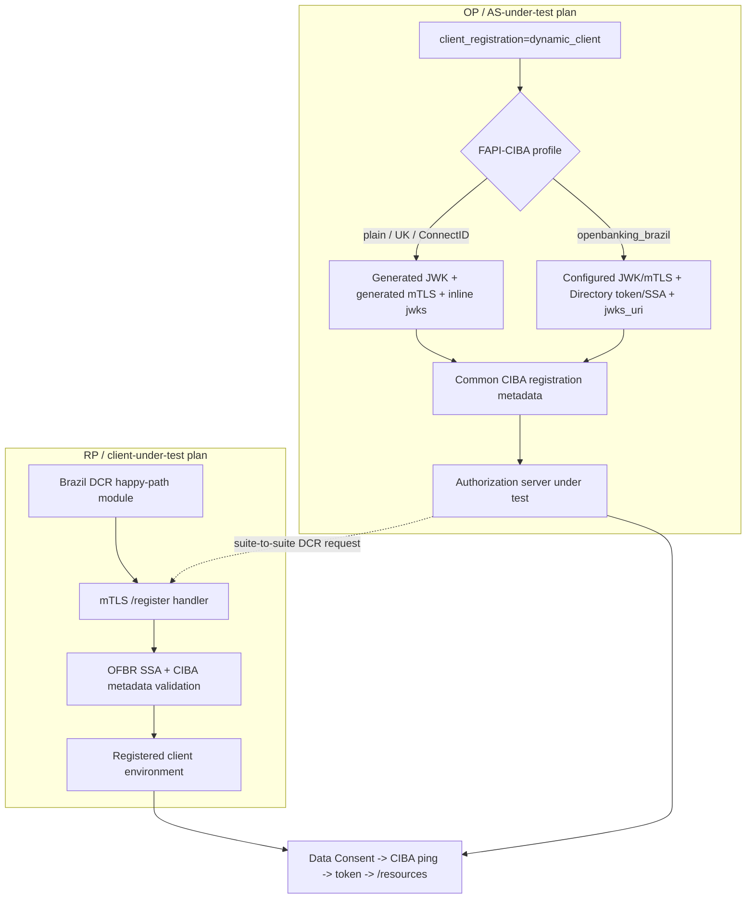

# OFBR FAPI-CIBA DCR and DCM support - Plan

## Goal Capsule

- **Objective:** Add the confirmed Open Finance Brasil FAPI-CIBA dynamic-registration happy path on both conformance surfaces, prove it suite-to-suite, and leave broader certification enforcement and negative DCR/DCM coverage behind explicit stakeholder gates.
- **Origin:** U4 and U12 in `docs/plans/2026-06-17-001-feat-ofbr-ciba-beta1-plan.md`, refined by `docs/specs/joseph slack thread.png` and Joseph's 2026-07-16 follow-up quoted in the planning discussion.
- **Execution branch:** `1824-ofbr-ciba-dcr`, based on `1824-ofbr-ciba` after U11.
- **Core completion:** U1-U5 are implementation-ready under Joseph's confirmed two-sided happy-path direction. They add the registration path on both sides, the RP-side DCR module, one suite-to-suite pairing, and documentation.
- **Remaining gates:** U6 is a separate policy question about rejecting static scheduling across the full OP plan. U7 and U8 require explicit confirmation of negative initial-DCR and DCM coverage.
- **Stop conditions:** Stop and return for direction if OFBR sandbox SSA/key material cannot produce a CIBA registration request that satisfies both the OFBR DCR profile and CIBA Core, or if the work would require a new generic DCR/DCM framework.
- **Shipping boundary:** Implement and verify locally. Do not open or update a GitLab merge request unless the user explicitly asks for that later.

---

## Product Contract

### Summary

Add the smallest useful DCR surface for OFBR FAPI-CIBA:

1. The existing FAPI-CIBA OP plan's `dynamic_client` path becomes capable of performing an OFBR-compliant registration before the normal Brazil CIBA flow.
2. The FAPI-CIBA RP plan gains one Brazil-only DCR happy-path module, following the shape of `fapi1-advanced-final-client-brazildcr-happypath-test` rather than adding a plan-wide static/dynamic switch.
3. CI pairs those two surfaces once so a real OFBR DCR request is followed by the existing Data Consent, ping, token, and `/resources` flow.

Joseph confirmed this happy-path coverage on both sides and confirmed that the OP path needs the Brazil software-statement retrieval flow. Static-client Brazil regression coverage remains available unless the narrower U6 policy decision later requires the full OP plan to reject it. Negative DCR and DCM publication remain separately gated.

### Problem Frame

The current code has an apparent asymmetry:

- The OP/authorization-server tests already expose `client_registration=dynamic_client`, but that path is generic CIBA. It generates a new PS256 key and self-signed mTLS certificate, sends `jwks` by value, does not obtain an OFBR Directory software statement, and does not use the Directory `software_jwks_uri`. That is not sufficient for OFBR DCR.
- The RP/client tests always load a static client and have no DCR module. They cannot receive and validate a participant's OFBR CIBA registration request.
- Existing FAPI1 Advanced Final Brazil tests already demonstrate both directions: an OP-side DCR client and an RP-side happy-path registration endpoint. Reusing their conditions and lifecycle is lower risk than inventing a CIBA-specific registration framework.

There are three different questions which must not be collapsed:

- **Normative support:** The OFBR CIBA beta1 and OFBR DCR profile describe DCR/DCM behavior for Brazil participants.
- **Confirmed happy-path coverage:** Joseph confirmed an FAPI1-style DCR happy-path module in the RP plan and DCR coverage on the OP side. He also confirmed that adapting the current OP dynamic path requires the Brazil software-statement retrieval flow.
- **Remaining policy scope:** The follow-up does not explicitly require removal of every static regression schedule and does not activate negative initial-DCR or DCM PUT modules.

The core work implements the confirmed two-sided happy path. U6-U8 keep the remaining policy choices separate.

### Actors

- **A1. Authorization server under test.** Receives OFBR CIBA DCR from the suite and then serves the normal CIBA flow.
- **A2. RP/client under test.** Discovers the suite, registers itself using OFBR DCR, and then performs the normal CIBA flow.
- **A3. Certification operator.** Schedules Brazil CIBA tests with committed sandbox-style configuration or participant-specific Directory material.
- **A4. Certification owner/tech lead.** Confirmed two-sided DCR happy-path coverage and decides the remaining full-plan enforcement and negative DCR/DCM policy.

### Requirements

**OP / authorization-server happy path**

- R1. For `fapi_ciba_profile=openbanking_brazil` plus `client_registration=dynamic_client`, the suite must obtain an OFBR Directory access token and a fresh PS256-signed software statement before registering.
- R2. The registration call must use configured OFBR mTLS material. It must not use the generic self-signed certificate generated by the current dynamic CIBA path.
- R3. The request must use `jwks_uri` from the software statement, must not send `jwks` by value, and the resolved JWKS must provide the encryption key required by the Brazil encrypted ID Token flow.
- R4. The request must include the CIBA grant, `backchannel_token_delivery_mode=ping`, an HTTPS `backchannel_client_notification_endpoint`, `backchannel_authentication_request_signing_alg=PS256`, private-key JWT client authentication metadata, and absent or false `backchannel_user_code_parameter`.
- R5. The request must retain the OFBR DCR metadata needed to satisfy the software statement, including an SSA-authorized `redirect_uris` value when supplied by the Directory, even though the CIBA flow itself does not redirect.
- R6. A successful registration must return usable client credentials and the OFBR-required registration management credentials; it must then complete the existing Brazil Data Consent, CIBA ping, token, encrypted ID Token, and `/resources` flow.
- R7. Generic CIBA dynamic registration for plain FAPI, UK, and ConnectID must keep its current generated-key behavior.

**RP / client-under-test happy path**

- R8. `fapi-ciba-id1-client-test-plan` must include one dedicated Brazil-only DCR happy-path module; it must not add a plan-wide `ClientRegistration` variant.
- R9. The module must advertise the normal and mTLS registration endpoints, reject non-mTLS registration, validate the OFBR Directory software statement and base OFBR DCR metadata, and register the resulting client in the suite environment.
- R10. The module must validate the CIBA grant, ping mode, HTTPS notification endpoint, PS256 request signing, and absent-or-false `backchannel_user_code_parameter` before accepting the registration.
- R11. The module must resolve `jwks_uri`, require suitable signing and encryption keys, apply the Brazil ID Token encryption defaults where the registration request omits them, and then run the normal Brazil CIBA happy flow.
- R12. The RP-side happy module may return management credentials and tolerate cleanup, but the core delivery must not claim DCM coverage merely because a cleanup DELETE occurs.

**Plan and certification behavior**

- R13. Add one suite-to-suite pairing between the new RP DCR module and the OP plan's Brazil dynamic-client happy module.
- R14. Add confirmed dynamic-client DCR coverage on both sides while retaining current static-client regression pairings unless U6 explicitly changes full-plan scheduling policy.
- R15. Do not publish a negative initial-registration test for `backchannel_user_code_parameter=true` until the negative-DCR activation gate is confirmed.
- R16. Do not publish a CIBA DCM PUT test until the DCM activation gate is confirmed.
- R17. If U8 is activated, DCM coverage is OP-side only: the suite can issue a PUT to an AS under test, but it has no standard way to force an external RP under test to issue a metadata update.
- R18. Test configurations must reuse synthetic or committed OFBR sandbox material and must not introduce production secrets.
- R19. The beta1 requirement matrix and U4/U12 issue drafts must distinguish implemented happy-path coverage, activated certification coverage, and explicit limitations.

### Key Flows

#### F1. Suite registers at an authorization server under test

- **Trigger:** A3 starts an OFBR CIBA OP module with `client_registration=dynamic_client`.
- **Steps:** The suite discovers the AS; obtains an OFBR Directory token and SSA over mTLS; builds an OFBR+CIBA registration request; registers over the AS mTLS registration endpoint; validates and stores the returned client; runs the established Brazil CIBA flow.
- **Outcome:** A1 proves it accepts a valid OFBR CIBA client registration and can use that client in a complete ping-mode flow.
- **Covered by:** R1-R7.

#### F2. Client under test registers at the suite

- **Trigger:** A3 starts the new Brazil DCR happy-path module in the RP test plan.
- **Steps:** A2 discovers the suite registration endpoint; obtains its Directory SSA; registers over mTLS; the suite validates OFBR and CIBA metadata; the suite stores the client and continues with Data Consent, CIBA ping, token redemption, encrypted ID Token, and `/resources`.
- **Outcome:** A2 proves it can register a usable OFBR CIBA ping client and then behave as that client.
- **Covered by:** R8-R12.

#### F3. Suite-to-suite proof

- **Trigger:** The CIBA integration runner executes the focused DCR pairing.
- **Steps:** The suite RP module exposes DCR; the suite OP module registers dynamically; both sides complete the same Brazil CIBA flow.
- **Outcome:** Request metadata, registration response handling, registered key use, and the post-registration CIBA journey are exercised together.
- **Covered by:** R13, R18.

#### F4. Remaining certification-policy activation

- **Trigger:** A4 answers one of the remaining U6-U8 policy questions.
- **Steps:** Record the answer in the matrix; activate only the matching gated units; keep the others explicitly deferred.
- **Outcome:** Published plan behavior reflects an explicit certification decision rather than an inference from implementation capability.
- **Covered by:** R14-R17, R19.

### Acceptance Examples

- AE1. **Covers R1-R6.** Given a Brazil dynamic-client OP run with valid sandbox Directory material, when the suite registers, then the request uses mTLS plus a fresh PS256 SSA, contains `jwks_uri` and no inline `jwks`, contains the CIBA ping metadata, and the registered client completes the Brazil CIBA happy flow.
- AE2. **Covers R3, R6.** Given the Directory JWKS contains the configured signing key and a `use=enc` key, when the AS returns an encrypted ID Token using the Brazil algorithms, then the suite decrypts and validates it with the registered client material.
- AE3. **Covers R7.** Given a non-Brazil dynamic CIBA run, when the suite registers, then it still uses the existing generated JWK and certificate path and does not require OFBR Directory configuration.
- AE4. **Covers R8-R11.** Given an RP under test sends a valid OFBR CIBA registration request to the suite's mTLS endpoint, when validation succeeds, then the suite returns a client identifier and management credentials and waits for the normal CIBA flow.
- AE5. **Covers R9.** Given the same registration request is sent to the non-mTLS endpoint or with the wrong configured certificate, when the suite receives it, then the DCR happy-path module fails or rejects the request before creating a client.
- AE6. **Covers R10.** Given the client requests poll/push, omits the required ping notification endpoint, uses a non-HTTPS notification endpoint, omits the CIBA grant, uses a non-PS256 request-signing algorithm, or sends `backchannel_user_code_parameter=true`, when the suite validates the happy-path registration, then it does not accept the client.
- AE7. **Covers R13.** Given the focused suite-to-suite DCR pairing, when the OP side registers at the RP side, then the pairing reaches successful `/resources` completion without a preconfigured client id.
- AE8. **Covers R14.** Given an existing static-client OFBR CIBA regression configuration, when the confirmed DCR happy path is added and U6 has not separately required dynamic-only scheduling, then the static configuration remains valid and retains its existing certification profile name.
- AE9. **Covers R15.** Given only the core units are implemented, when the OP plan is listed, then no newly published negative `backchannel_user_code_parameter=true` registration module is present.
- AE10. **Covers R16-R17.** If DCM is activated, given a valid dynamically registered client, when the suite PUTs a full metadata document with only `backchannel_user_code_parameter` changed to true, then the AS returns HTTP 400 JSON with `error=invalid_client_metadata`; no RP-side DCM claim is made.

### Scope Boundaries

- No new OP-side DCR test plan; use the existing FAPI-CIBA OP `ClientRegistration` variant.
- No RP-plan-wide static/dynamic selector; use one dedicated Brazil DCR happy-path module.
- No broad port of the FAPI1/FAPI2 Brazil DCR negative matrix.
- No generic DCR/DCM framework extraction unless implementation proves a small shared sequence is insufficient.
- No change to Brazil Data Consent, ping, token, refresh-token, or `/resources` semantics except what is necessary to consume the newly registered client.
- No payments CIBA flow.
- No claim that cleanup DELETE proves U12/DCM.
- No GitLab issue, merge request, or remote branch mutation as part of this planning task.

---

## Planning Contract

### Product Contract Preservation

The Product Contract above is the confirmed scope. U1-U5 may proceed based on Joseph's answer. U6-U8 remain separate policy gates even if their implementation appears straightforward.

### Research Findings

#### Current FAPI-CIBA OP support is generic, not OFBR-sufficient

`AbstractFAPICIBAID1.registerClient()` already adds the CIBA grant, delivery mode, notification endpoint, PS256 request signing, and `backchannel_user_code_parameter=false`. However, it also generates a new key and self-signed certificate and sends the public `jwks` inline. `OpenBankingBrazilCibaServerProfileBehavior` currently adds no registration steps. This misses the OFBR Directory token/SSA exchange, configured Brazil certificate, `jwks_uri`, SSA matching, and OFBR response assertions.

The existing dynamic variant is therefore useful plumbing but not sufficient Brazil coverage.

#### Current FAPI-CIBA RP support is static-only

`AbstractFAPICIBAClientTest` requires `client.client_id`, `client.certificate`, and `client.jwks`; its configuration path always loads the static client. The RP plan has no `ClientRegistration` variant and no registration handler module.

The closest precedent is `FAPI1AdvancedFinalBrazilClientDCRHappyPathTest`: it suppresses static client configuration, receives `/register` over mTLS, validates the Directory SSA and registration metadata, creates a client, fetches its keys, and then continues the protocol flow. The CIBA module should reuse those conditions and lifecycle boundaries without inheriting the authorization-code flow.

#### Stakeholder answer confirms both implementation directions

Joseph confirmed that the RP plan should have the FAPI-CIBA equivalent of `FAPI1AdvancedFinalBrazilClientDCRHappyPathTest` and that DCR coverage is needed on the OP side too. He noted that the current OP dynamic-client support was originally built to solve Authlete ping-endpoint registration, had not been evaluated for Brazil, and would need the full Brazil software-statement retrieval flow. This unlocks U1-U5 without claiming that negative DCR, DCM, or removal of all static regression coverage was also approved.

#### DCM is testable in only one direction

For an AS under test, existing conditions can create a full PUT body from the DCR response, attach a fresh SSA, call the registration client URI, and assert the error. For an RP under test, the suite cannot make the external client decide to issue a management PUT through a standard CIBA interaction. U12 can therefore provide OP-side coverage and an explicit RP-side limitation, but not symmetric tests.

### Key Technical Decisions

- KTD1. **Use a dedicated RP DCR module, not a new variant.** (session-settled: user-directed — chosen over a plan-wide RP registration selector: Joseph confirmed the FAPI1-style DCR happy-path module.) This follows the existing FAPI1 Advanced Brazil client-test plan and avoids making every FAPI-CIBA RP module responsible for two client lifecycles.
- KTD2. **Use the existing OP dynamic-client variant, not a separate OP DCR plan.** (session-settled: user-approved — chosen over a separate OP DCR plan: the existing CIBA dynamic path can be adapted once it gains OFBR software-statement retrieval.) The generic CIBA registration lifecycle already exists; the missing piece is a Brazil provisioning strategy and stronger OFBR assertions.
- KTD3. **Split dynamic registration into profile provisioning plus common CIBA metadata.** The default provisioning strategy keeps generated JWKs, generated mTLS, and inline `jwks`. The Brazil strategy loads configured JWK/mTLS material, obtains the Directory SSA, publishes `jwks_uri`, and adds the software statement. Common code continues to add the CIBA grant, delivery mode, notification endpoint, client authentication, and TLS-bound-token metadata.
- KTD4. **Do not use the generic initial access token for Brazil.** OFBR registration is authenticated by the Directory-issued certificate/SSA flow. Keep the existing initial-access-token behavior for other profiles.
- KTD5. **Build the strictest interoperable positive request for `redirect_uris`.** CIBA Core says ping/poll use `jwks_uri` in place of `redirect_uri`, while OFBR DCR 7.1.6 says the AS shall require `redirect_uris` to match or be a subset of the SSA. The positive OFBR request will include an SSA-authorized redirect URI even though the CIBA flow does not use it. Missing-redirect negative coverage remains outside this plan.
- KTD6. **Treat explicit ID Token encryption metadata and effective encryption behavior separately.** The request may rely on OFBR AS defaults for RSA-OAEP/A256GCM where permitted, but the registered client and resolved JWKS must still make encrypted ID Tokens work and must include a suitable encryption key.
- KTD7. **Accept a narrow configuration-form tradeoff instead of adding conditional-field framework work.** The current UI unions selected-variant hides and a hide always wins; it cannot express “show `client.jwks` and `mtls.*` only for Brazil + dynamic.” Remove those fields from the FAPI-CIBA dynamic hide set so Brazil DCR inputs can be supplied. Non-Brazil dynamic registration continues to ignore them and generate credentials. If this proves too confusing during implementation, stop before inventing duplicate Brazil-only key fields.
- KTD8. **Keep static regression coverage while adding the confirmed dynamic DCR path.** Joseph confirmed DCR coverage on the OP side but did not explicitly require deleting every static schedule. U6 owns any later dynamic-only enforcement after a full-module audit.
- KTD9. **Core happy flow validates sender metadata but does not publish an AS negative DCR test.** The RP happy-path module rejects a client that sends true because that is invalid happy-path sender behavior. A separately published OP test that deliberately sends true is U7 and remains gated.
- KTD10. **Do not count management credentials or cleanup as DCM coverage.** U8 requires an intentional PUT and exact response assertions.
- KTD11. **Use committed sandbox material only.** New CI fixtures may derive from the existing Brazil DCR and CIBA fixtures but must not add real participant secrets.

### High-Level Technical Design

### Decision Status and Remaining Gates

| Decision or gate | Status | Units affected | Consequence |
|---|---|---|---|
| D1. Two-sided DCR happy path | Resolved yes by Joseph on 2026-07-16 | U1-U5 | Add the RP DCR module and adapt the OP dynamic path with OFBR software-statement retrieval. |
| G1. Full-plan dynamic-only enforcement | Pending: should Brazil OP scheduling reject `static_client` after the DCR path exists? | U6 | Keep static regression schedules available until this narrower policy is explicit. |
| G2. Negative initial DCR | Pending: does the active certification round require an AS test that sends `backchannel_user_code_parameter=true`? | U7 | Do not publish the negative module. |
| G3. DCM | Pending: does the active certification round require a PUT test for the same metadata restriction? | U8 | Record OP-side feasibility and RP-side limitation; do not publish a DCM module. |

D1 does not implicitly answer G1-G3.

### System-Wide Impact

- **Configuration:** Brazil OP dynamic registration starts consuming Directory discovery, client id, API base, keystore, client JWK, and mTLS fields. Static Brazil and non-Brazil dynamic behavior must remain compatible.
- **Discovery/endpoints:** The CIBA RP emulator does not yet advertise registration endpoints. U3 adds the normal `registration_endpoint`, its mTLS alias, and the corresponding handlers only in the DCR module so existing static modules do not advertise unsupported registration.
- **State:** A successful DCR response must populate the same `client`, `client_jwks`, `client_public_jwks`, and mTLS environment used by the existing CIBA flow. Do not create a parallel client-state model.
- **Security boundary:** Incoming registration is mTLS-only, SSA signature/freshness is validated against Directory keys, inline JWKs are rejected, and the configured certificate is matched before client creation.
- **Lifecycle:** The DCR happy flow creates an external AS client or a suite-emulated client. Cleanup must remain safe after partial setup, failed registration, and successful completion.
- **CI:** One new CIBA pairing exercises both sides. Existing static Brazil pairings remain to catch regressions and preserve current coverage.
- **Documentation:** The matrix and issue drafts must stop describing DCM as “surface uncertain”; the surface is known to be OP-testable and RP-not-triggerable, with activation still pending.

### Risks & Mitigations

- **OFBR DCR versus CIBA redirect semantics:** Use an SSA-authorized redirect URI in the positive request, document why, and defer omission behavior. Stop if the sandbox SSA provides no usable URI.
- **Configuration-field conjunction limitation:** Make the smallest annotation change described by KTD7 and test plan metadata manually. Do not broaden this work into a configuration-form framework change.
- **Key-role mismatch:** Validate both signing and `use=enc` keys from the resolved `jwks_uri`; prove the encryption path in the suite-to-suite run, not only request shape in unit tests.
- **Generated credentials leaking into Brazil:** Keep Brazil credential provisioning in an explicit profile strategy and add unit/structural coverage that the Brazil request has no inline `jwks`.
- **Unintended full-plan dynamic claim:** Joseph confirmed DCR on the OP side, but U1-U5 prove a focused happy path. Do not claim every two-client/negative OP module is Brazil-DCR ready or reject static scheduling until U6 audits those modules and receives an explicit policy answer.
- **DCM overclaim:** An incidental DELETE is cleanup. Only U8's deliberate authenticated PUT with response checks counts as CIBA DCM coverage.
- **External Directory availability:** Unit tests cover request construction and validation without network access. Integration runs use existing sandbox configuration and may report a concrete external dependency blocker.
- **Sensitive fixtures:** Compare only key names and configuration shapes during planning/review; never paste private values into documentation or logs.

### Open Questions

#### Resolved for the core

- The RP side uses a dedicated DCR happy-path module, not a selector.
- The OP side extends the current dynamic-client variant, not a separate DCR plan.
- Joseph confirmed that both RP and OP certification surfaces need DCR happy-path coverage.
- The OP dynamic path must retrieve and use the Brazil software statement.
- The first deliverable is positive DCR plus one suite-to-suite happy path.
- DCM, if activated, is OP-side only; the RP limitation is documented.

#### Deferred to the gates

- Whether Brazil OP scheduling should reject `static_client` across the full plan after the focused DCR path is proven.
- Whether to publish the initial DCR `backchannel_user_code_parameter=true` negative test.
- Whether to publish the DCM PUT `backchannel_user_code_parameter=true` negative test.

---

## Implementation Units

### U1. Refactor FAPI-CIBA dynamic registration around profile provisioning

- **Goal:** Create a narrow extension point so Brazil can supply Directory-backed credentials and metadata while every other profile keeps the current generated path.
- **Requirements:** R1-R5, R7.
- **Dependencies:** None.
- **Files:** `src/main/java/net/openid/conformance/fapiciba/AbstractFAPICIBAID1.java`, `src/main/java/net/openid/conformance/fapiciba/FAPICIBAServerProfileBehavior.java`, `src/main/java/net/openid/conformance/fapiciba/OpenBankingBrazilCibaServerProfileBehavior.java`, a focused sequence under `src/main/java/net/openid/conformance/sequence/client/` if useful, and matching unit tests under `src/test/java/`.
- **Approach:** Split the current `registerClient()` credential/key-publication phase from its common CIBA metadata phase. The default behavior must still generate PS256 JWKs, derive a self-signed mTLS certificate, and add public JWKs by value. The Brazil behavior must instead load configured client JWK/mTLS material, skip initial-access-token handling, obtain the Directory SSA, take `jwks_uri` and an authorized redirect URI from that SSA, and add the software statement. Keep the common CIBA grant, delivery-mode, notification-endpoint, request-signing, auth-method, and TLS-bound-token conditions in one path.
- **Configuration note:** Remove `client.jwks`/`mtls.*` (and corresponding second-client fields if the refactor touches them) from the FAPI-CIBA dynamic hide list so a Brazil dynamic run can receive the required values. Do not add duplicate Brazil-only key fields or change the generic form adapter.
- **Patterns to follow:** `AbstractFAPI1AdvancedFinalBrazilDCR.configureClient()`, `getSsa()`, `setupJwksUri()`, and the existing `FAPICIBAServerProfileBehavior.getAdditionalClientRegistrationSteps()` hook.
- **Test scenarios:** The default strategy still calls generated-key setup. The Brazil strategy requires configured JWK/mTLS material and Directory fields, does not generate a self-signed client, does not use an initial access token, adds `jwks_uri` and SSA, and leaves no inline `jwks`. The final request includes CIBA grant, ping, HTTPS notification endpoint, PS256 request signing, and absent/false user-code support.
- **Verification:** Focused unit tests pin both strategies and `git diff --check` passes before U2.

### U2. Complete and validate the OP-side OFBR CIBA DCR happy path

- **Goal:** Make the existing Brazil dynamic-client happy module prove registration and then consume the registered client in the normal CIBA flow.
- **Requirements:** R1-R7.
- **Dependencies:** U1.
- **Files:** `src/main/java/net/openid/conformance/fapiciba/AbstractFAPICIBAID1.java`, `src/main/java/net/openid/conformance/fapiciba/OpenBankingBrazilCibaServerProfileBehavior.java`, reusable conditions under `src/main/java/net/openid/conformance/condition/client/`, and matching `*_UnitTest.java` files.
- **Approach:** Reuse `CallDynamicRegistrationEndpointAndVerifySuccessfulResponse`, then add Brazil-specific assertions that management credentials are present, granted metadata is usable, and the response does not replace the requested OFBR/CIBA semantics with poll/push or user-code support. Copy scope and organization/client keys into the existing client environment, resolve the configured `jwks_uri`, and prove the established encrypted-ID-Token path uses that registered state. Keep cleanup best-effort and safe if registration failed before credentials were returned.
- **Patterns to follow:** `AbstractFAPI1AdvancedFinalBrazilDCR.callRegistrationEndpoint()`, `ClientManagementEndpointAndAccessTokenRequired`, `CopyScopeFromDynamicRegistrationTemplateToClientConfiguration`, and existing Brazil ID Token validation in `OpenBankingBrazilCibaServerProfileBehavior`.
- **Test scenarios:** Valid registration returns 201 JSON and a client id; management URI/token are present; registered mode remains ping; the client can authenticate at backchannel/token endpoints; the AS encrypts the ID Token with the Directory-published key; `/resources` completes; cleanup does not mask the test result. A 201 response with unusable or contradictory CIBA metadata fails before the authorization flow.
- **Verification:** Focused condition/module tests pass. A local schedule metadata check confirms Brazil dynamic configuration can accept the required key/certificate fields while static configurations still retain their fields.

### U3. Add the RP-side OFBR CIBA DCR happy-path module

- **Goal:** Let an external RP register at the suite and then complete the Brazil CIBA happy flow without a preconfigured client id.
- **Requirements:** R8-R12.
- **Dependencies:** U1 may proceed in parallel, but U3 must be complete before U4.
- **Files:** `src/main/java/net/openid/conformance/fapiciba/rp/FAPICIBAClientBrazilDCRHappyPathTest.java` (proposed name), `src/main/java/net/openid/conformance/fapiciba/rp/FAPICIBAClientTestPlan.java`, a focused registration-endpoint discovery condition under `src/main/java/net/openid/conformance/fapiciba/rp/`, new CIBA registration validation conditions under `src/main/java/net/openid/conformance/condition/as/dynregistration/`, and matching unit tests.
- **Approach:** Add a Brazil-only module that overrides static client configuration and, from its configuration hook, adds the normal `registration_endpoint` and mTLS registration alias to discovery for this module only. The module then waits for mTLS `/register`, captures and parses the request, validates the configured client certificate, validates/fetches the Directory SSA keys, and reuses the base OFBR DCR conditions for SSA signature/freshness, no inline `jwks`, `jwks_uri` matching, redirect subset, auth method, and client metadata. Add small CIBA-specific conditions for the CIBA grant, ping-only mode, HTTPS notification endpoint, PS256 request signing, and absent/false `backchannel_user_code_parameter`. Create the client plus registration management credentials, fetch its JWKS, require a usable encryption key, apply Brazil encryption defaults, and resume the inherited CIBA flow.
- **Lifecycle note:** Return to `WAITING` after registration. Finish on the inherited post-`/resources` completion path. A management GET/PUT is not required for U3; DELETE may be accepted for cleanup without being counted as DCM coverage.
- **Patterns to follow:** `FAPI1AdvancedFinalBrazilClientDCRHappyPathTest` for HTTP routing, certificate/SSA validation, client creation, and failure handling; `AbstractFAPICIBAClientTest` for CIBA endpoints and state transitions; `FAPIBrazilRegisterClient` and `FetchClientKeys` for registered state.
- **Test scenarios:** Valid mTLS registration reaches 201 and the normal CIBA flow. Plain-TLS registration fails. Invalid certificate or SSA fails before client creation. Missing CIBA grant, non-ping mode, missing/non-HTTPS notification endpoint, non-PS256 signing, or user-code true fails. Omitted user-code metadata is accepted as false. A JWKS without an encryption key fails before the suite attempts encrypted token issuance.
- **Verification:** Unit tests cover each new condition's valid, missing, wrong-type, and invalid-value cases. Plan discovery lists the module only for the Brazil profile and the normal static happy module remains unchanged.

### U4. Add focused OFBR CIBA DCR fixtures and suite-to-suite coverage

- **Goal:** Prove the two new directions work together with one deterministic integration pairing.
- **Requirements:** R13, R14, R18.
- **Dependencies:** U2, U3.
- **Files:** `.gitlab-ci/run-tests.sh`, `scripts/test-configs-rp-against-op/fapi-ciba-brazil-op-test-config-dcr.json`, `scripts/test-configs-rp-against-op/fapi-ciba-brazil-rp-test-config-dcr.json` (proposed names), and only the minimum related config files required by the runner.
- **Approach:** Derive the OP-under-test fixture from `fapi-brazil-op-test-config-accounts-dcr.json` plus the current CIBA Brazil OP fixture, and derive the RP fixture from the current CIBA Brazil RP fixture. Reuse existing sandbox Directory, signing, encryption, and mTLS material; do not add production values. Add one pairing whose RP side is the new DCR module and whose OP side is the normal FAPI-CIBA happy module selected with Brazil/private-key-JWT/ping/dynamic-client. Keep all existing static-client Brazil pairings.
- **Patterns to follow:** The FAPI1 Advanced Brazil DCR suite-to-suite pairing in `.gitlab-ci/run-tests.sh` and the current OFBR CIBA static pairings.
- **Test scenarios:** The runner schedules without a preconfigured OP-side `client_id`; the dynamic request reaches the RP module over mTLS; both sides agree on SSA, `jwks_uri`, CIBA metadata, and registered keys; the test completes through `/resources`; compare identities remain unique.
- **Verification:** List CIBA tests first, run only the newly numbered pairing, then run the broader CIBA integration set after the focused pairing passes.

### U5. Record delivered coverage and explicit limitations

- **Goal:** Make the implementation's certification meaning unambiguous before any gated expansion.
- **Requirements:** R14-R19.
- **Dependencies:** U4.
- **Files:** `docs/issues/ofbr-ciba-beta1/requirements-matrix.md`, `docs/issues/ofbr-ciba-beta1/004-op-dcr-metadata-restrictions.md`, `docs/issues/ofbr-ciba-beta1/005-dcm-metadata-assessment.md`, and `docs/issues/ofbr-ciba-beta1/README.md` if its status summary needs correction.
- **Approach:** Mark the happy DCR flow implemented on OP and RP surfaces and record Joseph's 2026-07-16 confirmation. Record that static regression coverage remains active pending G1, the deliberate OP negative DCR module is not activated pending G2, DCM PUT is technically buildable only against an AS under test pending G3, and RP-side DCM cannot be triggered by the standard suite interaction. Link the exact CI pairing and keep the three remaining gates visible.
- **Test scenarios:** Test expectation: none -- this is delivery traceability.
- **Verification:** A reviewer can distinguish “implemented capability,” “published/required certification coverage,” and “deferred by stakeholder gate” for beta1 6.2.4, 6.3.5, and 6.3.8.

### U6. Policy follow-up: decide whether the full OP plan is dynamic-only

- **Goal:** Decide whether the confirmed OP DCR coverage also means Brazil scheduling must reject `static_client` across the complete OP plan.
- **Requirements:** R14, R19.
- **Dependencies:** U4, G1 answered explicitly.
- **Files:** `src/main/java/net/openid/conformance/fapiciba/FAPICIBAID1TestPlan.java`, `.gitlab-ci/run-tests.sh`, the requirement matrix, and focused plan-scheduling tests under `src/test/java/net/openid/conformance/plan/`.
- **Approach:** Joseph's answer is enough to build and publish the two-sided DCR happy path, but it is not treated as an instruction to remove static regression coverage. If G1 later says dynamic-only, audit every OP module published for Brazil dynamic selection, especially second-client modules, before rejecting static in `certificationProfileName`. If G1 says additive coverage, leave certification validation and static CI unchanged and record that decision.
- **Stop condition:** Do not enforce `client_registration=dynamic_client` merely because U1-U5 pass.
- **Test scenarios:** Mandatory branch: static Brazil OP scheduling is rejected with a user-facing explanation and the complete applicable dynamic plan is runnable. Additive branch: both static and dynamic schedules remain valid and names do not falsely imply DCR certification.
- **Verification:** Plan-list/scheduling tests cover the chosen branch and the matrix cites the stakeholder decision date.

### U7. Gate: add the OP negative initial-DCR user-code test

- **Goal:** Verify an AS rejects `backchannel_user_code_parameter=true` during initial registration when G2 activates that certification requirement.
- **Requirements:** R15, R19.
- **Dependencies:** U2, G2 answered yes.
- **Files:** A new Brazil-only module under `src/main/java/net/openid/conformance/fapiciba/`, `FAPICIBAID1TestPlan.java`, a reusable request mutation condition under `src/main/java/net/openid/conformance/condition/client/`, and its unit test.
- **Approach:** Start from the valid OFBR CIBA request built by U1, mutate only `backchannel_user_code_parameter` to true immediately before POST, call the registration endpoint, and assert HTTP 400, JSON content type, and `error=invalid_client_metadata`. Finish after the error; do not enter the CIBA flow or attempt unregister without returned credentials.
- **Patterns to follow:** `FAPI1AdvancedFinalBrazilDCRInvalidJwksByValue`, `EnsureHttpStatusCodeIs400`, and `CheckErrorFromDynamicRegistrationEndpointIsInvalidClientMetadata`.
- **Test scenarios:** The mutation condition replaces false or absent with boolean true. Exact 400+JSON+`invalid_client_metadata` passes. A 201, a non-400 response, a non-JSON error, or a different OAuth error fails.
- **Verification:** New unit tests and a focused OP integration run pass before the module is treated as published certification coverage.

### U8. Gate: add the OP DCM user-code update test and document the RP limitation

- **Goal:** Verify an AS rejects an otherwise valid client metadata update that enables user code when G3 activates DCM coverage.
- **Requirements:** R16, R17, R19.
- **Dependencies:** U2, G3 answered yes. U7's mutation condition may be reused but U7 publication is not otherwise required.
- **Files:** A new Brazil-only module under `src/main/java/net/openid/conformance/fapiciba/`, `FAPICIBAID1TestPlan.java`, reusable client-configuration request conditions if needed, and the requirement matrix/U12 issue draft.
- **Approach:** Complete valid DCR first. Create a full RFC7592 PUT document from the registration response, obtain and attach a fresh SSA if required by OFBR, change only `backchannel_user_code_parameter` to true, authenticate with the returned registration access token and mTLS certificate, then assert HTTP 400 JSON with `invalid_client_metadata`. Keep the original client usable for cleanup. Record that no symmetric RP module exists because the suite cannot trigger an external client to send this PUT.
- **Patterns to follow:** `FAPI1AdvancedFinalBrazilDCRUpdateClientConfigInvalidJwksByValue`, `CreateClientConfigurationRequestFromDynamicClientRegistrationResponse`, `AddSoftwareStatementToClientConfigurationRequest`, and `CallClientConfigurationEndpoint`.
- **Test scenarios:** Valid DCR precedes PUT. The PUT contains the full registered metadata plus fresh SSA. Only the user-code flag differs. Exact error response passes. The original registration remains cleanable. No RP-side DCM claim appears in the matrix.
- **Verification:** Focused unit and integration tests pass; the documentation identifies OP coverage and RP limitation separately.

---

## Verification Contract

| Gate | Applies To | Command / Check | Expected Result |
|---|---|---|---|
| Patch hygiene | All units | `git diff --check` | No whitespace errors. |
| Focused unit tests | U1-U3, U7-U8 when activated | `mvn test -Dtest='<new and directly affected *_UnitTest classes>'` | Registration strategy, metadata validation, and mutations pass before broader tests. |
| CIBA plan discovery | U3-U4 | `.gitlab-ci/run-tests.sh --ciba-tests --list` | The new RP DCR module/pairing is listed with a discoverable rerun number; existing Brazil static pairings remain. |
| Focused suite-to-suite | U4 | `./scripts/run-integration-tests.sh --ciba-tests --rerun <number discovered by --list>` | Registration and the full Brazil CIBA happy flow complete. Do not hard-code the plan number in docs or code. |
| Broader CIBA integration | U4 and activated gated units | `./scripts/run-integration-tests.sh --ciba-tests` | Existing generic, ConnectID, and Brazil static/dynamic CIBA pairings remain healthy; expected errors/warnings/skips are not treated as failures. |
| Full tests | All code units | `mvn test` | Unit, PMD, checkstyle, Error Prone, and architecture checks pass. |
| Clean build | All code units | `mvn -B -Dmaven.test.skip -Dpmd.skip clean package` | The final application packages successfully. |
| Gate audit | U6-U8 | Review the matrix, Joseph's 2026-07-16 answer, and any later policy answer before adding/enforcing modules | Only explicitly activated coverage is published or required. |

If the OFBR Directory sandbox is unavailable, finish all deterministic unit/build gates and report the exact external failure from the focused integration run; do not substitute static registration and claim DCR passed.

---

## Definition of Done

### Core DCR delivery (origin U4)

- The OP plan's Brazil dynamic happy path uses configured OFBR credentials, a fresh Directory SSA, `jwks_uri`, and no inline `jwks`.
- The registered client carries CIBA grant, ping notification, PS256 request-signing, private-key-JWT, TLS-bound-token, and absent/false user-code metadata.
- The OP happy path completes Data Consent, ping, token redemption, encrypted ID Token validation, and `/resources` using the dynamically returned client.
- The RP plan contains one Brazil-only DCR happy-path module and no plan-wide registration selector.
- Incoming registration is mTLS-only and validates OFBR SSA/base metadata plus CIBA-specific metadata and encryption-key availability.
- One suite-to-suite Brazil DCR pairing passes, and existing static pairings remain.
- The requirement matrix and issue drafts distinguish delivered happy-path capability from certification activation and DCM limitations.
- Targeted tests, the focused integration pairing, broader CIBA integration, full Maven tests, and clean package build pass, or an external Directory blocker is reported with concrete evidence.
- No GitLab merge request is opened or updated.

### Gated completion

- U6 is complete only when the narrower full-plan static/dynamic enforcement answer is recorded and applied.
- U7 is complete only when the published initial-DCR true-value test asserts exact HTTP 400 JSON `invalid_client_metadata` behavior.
- U8 is complete only when the published OP-side PUT test asserts the same error and the RP-side limitation remains explicit.

---

## Sources & References

### Project sources

- `docs/plans/2026-06-17-001-feat-ofbr-ciba-beta1-plan.md` -- origin U4/U12 scope and original DCR/DCM gate.
- `docs/issues/ofbr-ciba-beta1/requirements-matrix.md` -- beta1 clause mapping.
- `docs/issues/ofbr-ciba-beta1/004-op-dcr-metadata-restrictions.md` and `005-dcm-metadata-assessment.md` -- existing issue-level boundaries.
- `docs/specs/joseph slack thread.png` -- initial tech-lead suggestion to add at least a FAPI-CIBA DCR happy flow.
- Joseph's 2026-07-16 follow-up quoted in the planning discussion -- confirms the FAPI1-style RP module, OP-side DCR coverage, reuse of the current dynamic path as a viable direction, and the need for Brazil software-statement retrieval.
- `docs/specs/OF-[EN] Open Finance Brasil Client Initiated Backchannel Authentication - v2.1.0-beta1-170626-102314.pdf` -- beta1 clauses 6.2.2, 6.2.4, 6.3.5, and 6.3.8.
- `docs/specs/OF-[EN] Open Finance Brasil Financial-grade API Security Profile - v2.2.0-170626-155229.pdf` -- Brazil client creation and encrypted ID Token/JWKS requirements.
- `src/main/java/net/openid/conformance/fapiciba/AbstractFAPICIBAID1.java` and `OpenBankingBrazilCibaServerProfileBehavior.java` -- current OP dynamic path and missing Brazil registration hook.
- `src/main/java/net/openid/conformance/fapiciba/rp/AbstractFAPICIBAClientTest.java` and `FAPICIBAClientTestPlan.java` -- current RP static-client surface.
- `src/main/java/net/openid/conformance/fapi1advancedfinal/AbstractFAPI1AdvancedFinalBrazilDCR.java`, `FAPI1AdvancedFinalBrazilClientDCRHappyPathTest.java`, and `FAPI1AdvancedFinalBrazilDCRUpdateClientConfigInvalidJwksByValue.java` -- proven Brazil DCR/DCM patterns.
- `.gitlab-ci/run-tests.sh` and `scripts/test-configs-rp-against-op/` -- current Brazil DCR and CIBA suite-to-suite pairings/configuration.

### Authoritative external sources

- [Open Finance Brasil Dynamic Client Registration v2.1.0](https://openfinancebrasil.atlassian.net/wiki/spaces/OF/pages/1334116474/EN%2BOpen%2BFinance%2BBrasil%2BDynamic%2BClient%2BRegistration%2B-%2Bv2.1.0) -- mTLS, PS256 SSA, `jwks_uri`, encryption-key, redirect-URI, DCR, and DCM requirements.
- [OpenID Connect CIBA Core 1.0](https://openid.net/specs/openid-client-initiated-backchannel-authentication-core-1_0-final.html) -- CIBA registration metadata and the ping/poll `jwks_uri` versus redirect-URI rule.
- [RFC 7591](https://www.rfc-editor.org/rfc/rfc7591.html) -- dynamic registration request/response and `invalid_client_metadata` behavior.
- [RFC 7592](https://www.rfc-editor.org/rfc/rfc7592.html) -- authenticated client configuration GET/PUT/DELETE behavior and full-metadata update semantics.
